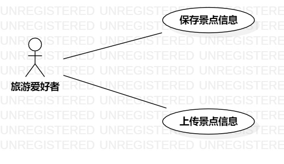

#  实验二： 用例建模

## 一.实验目标

1.使用Markdown写报告;      
2.选题并用例建模;  

## 二.实验内容

1.在GitHub使用Markdown修改实验一报告;    
2.在StarUML中画建模用例图;   
3.提交实验二报告;  

## 三.实验步骤

具体步骤：  
(1) 确定选题：#542 旅游景点推荐系统；  
(2) 确定Actor为：游客；    
(3) 用例一：收藏点评；  
(4) 用例二：上传点评；  
(4) 绘制uml图；  
(5) 编写实验报告 。  

## 四.实验结果

图一：旅游景点推荐系统的用例图

## 五.用例规约的编写

### 表1：保存景点信息用例1规约  

用例编号  | UC01 | 备注  
-|:-|-  
用例名称  | 收藏点评  |   
前置条件  | 登陆成功     | *可选*   
后置条件  | 游客收藏点评成功     | *可选*   
基本流程  | 1.游客点击收藏按钮  |*用例执行成功的步骤*    
~| 2. 系统弹出收藏界面  |   
~| 3. 游客点击确认收藏  |   
~| 4. 系统查询布匹点评信息，匹配到点评，保存匹配的点评，系统提示“收藏成功”；  | 
~| 5. 系统显示点评收藏成功页面。  | 
扩展流程  | 4.1 系统查询布匹点评信息，检查未存在相同布匹的点评，提示“收藏失败”。   |*用例执行失败*    

### 表2：上传景点信息用例2规约  

用例编号  | UC02 | 备注  
-|:-|-  
用例名称  | 上传点评  |   
前置条件  |  登陆成功    | *可选*   
后置条件  | 游客上传成功     | *可选*   
基本流程  | 1.游客点击点评上传  |*用例执行成功的步骤*    
~| 2. 系统弹出上传界面  |   
~| 3. 游客点击确定上传  |   
~| 4. 系统检查点评格式，点评格式正确，录入点评，系统提示“上传成功”  | 
~| 5. 系统显示点评上传成功页面。  | 
扩展流程  | 4.1 系统检查点评格式不正确，系统提示“上传失败”   |*用例执行失败* 
