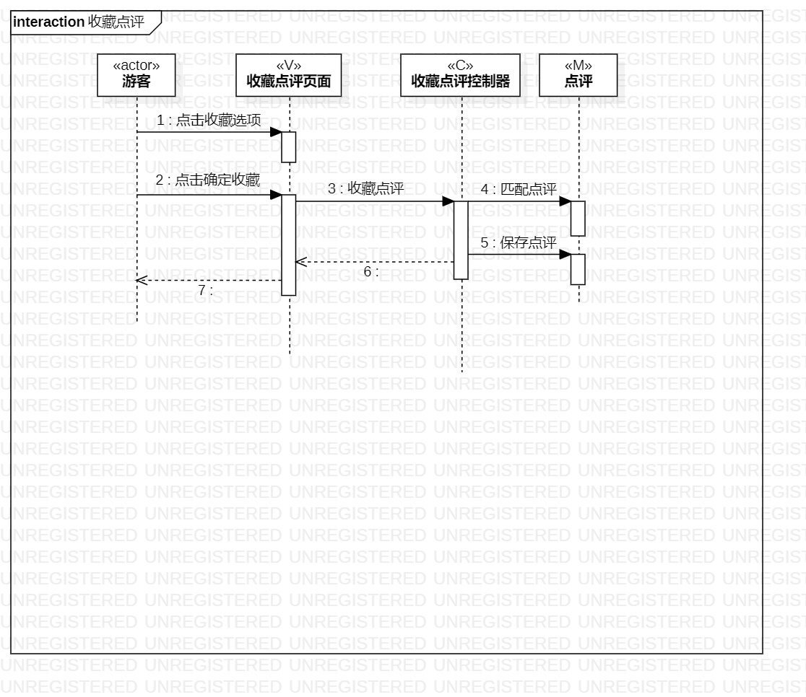
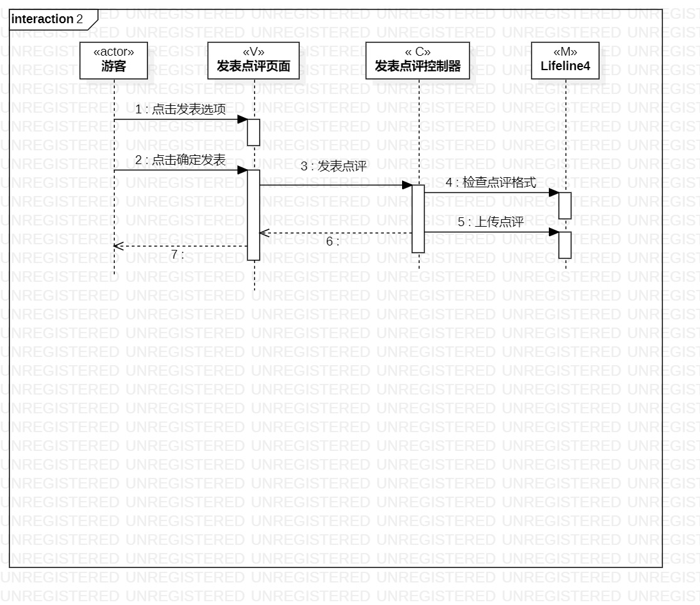

＃ 实验六：交互建模

## 一，实验目标

1.了解系统互动；  
2.掌握UML顺序图的画法；  
3.掌握对象交互的定义与建模方法。  

## 二，实验内容  

1.根据用例图和类图，确定系统内部对象和外部对象（演员）；  
2.创建时序图（Sequence Diagram）；  
3.在预先图上画出系统对象  
4.在预先图上画出消息（message）。  

## 三，实验步骤

1.确定系统对象  
   1.收藏点评  
      -游客（演员）  
      -收藏点评页面（型号）  
      -收藏点评控制器（Controller）  
      -点评（查看）  
   2.发表点评  
      -游客（演员）  
      -发表点评页面（型号）  
      -发表点评控制器（Controller）  
      -点评（查看）  
2.创建时序图（顺序图）  
3.画出系统对象  
4.画出消息（消息）  

## 四，实验结果

  
图1.收藏点评  

  
图2.发表点评  
