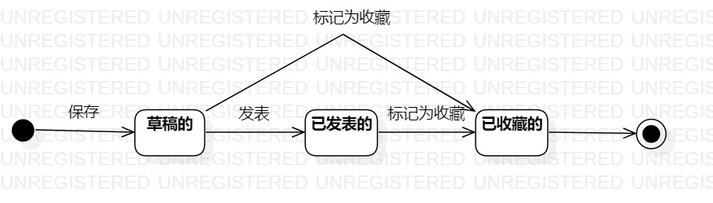

# 实验七：状态建模

## 一，实验目标

-掌握对象状态建模（状态图，Statechart）

## 二，实验内容

-根据用例图，用例规约，活动图，类图，顺序图，确定关键对象
-画出状态图

## 三，实验步骤

-1.观看教学视频，了解状态图的基本图形及用法;  
-2.根据用例图，用例规约，活动图，类图，顺序图，确定关键对象：点评  
-3.寻找对象攻略的相关状态：
    草稿的，发表的，收藏的  
-确定各状态之间的转换  
-保存状态图并提交至GitHub  

## 四，实验结果  
 
  

图1：点评的状态图  
