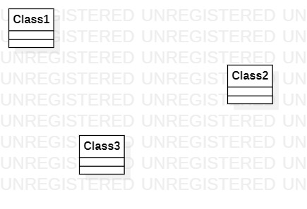

# 实验一

## 一、实验目标

1. 熟悉 GitHub 的实验过程
2. 安装与使用 StartUML 软件

## 二、实验内容

1. 安装 GitHub 软件并练习使用
2. 安装 StartUML 并创建第一个 UML 图

## 三、实验步骤

1. 下载 GitHub 和 StartUML 软件
2. 在 GitHub 上 fork 项目之后，克隆到本地的磁盘
3. 创建好实验一文档
4. 用 StartUML 软件绘制第一个 UML 图，导出图片
5. 用 Git 软件提交到 GitHub 上
6. 在 GitHub 用 Markdown 编辑文档，插入图片
7. 提交合并到主库中的请求

## 四、实验结果

1. 画图  
  
图1.在 StartUML 上创建的第一个 UML 图
