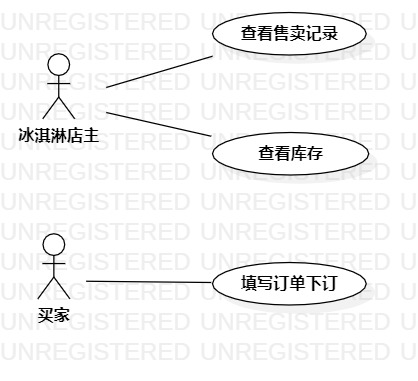

# 实验二：用例建模

## 一、实验目标

1. 学会使用 Markdown 编写实验报告
2. 学会使用 StartUML 软件用例建模
3. 细化选题并撰写用例规约

## 二、实验内容

1. 用例建模并绘制用例图
2. 编写实验报告
3. 编写用例规约

## 三、实验步骤

1. 确定自己的选题为 冰激凌售卖系统
2. 确定自己选题用例
3. 使用 StartUML 软件绘制用例图
4. 使用 git bash push 用例图到 GitHub 上
5. 使用 Markdown 编写实验报告
6. 编写用例规约

## 四、实验结果
  
   
图1：冰激凌售卖系统的用例图

# 用例规约的编写

## 表1：售卖冰激凌用例规约  

用例编号  | UC01 | 备注  
-|:-|-  
用例名称  | 售卖冰激凌 |   
前置条件  | 冰激凌店主登录进入冰激凌商品的详细信息界面 | *可选*   
后置条件  |      | *可选*   
基本流程  | 1.冰激凌店主填写售卖数量 |  *用例执行成功的步骤*
~| 2.店主点击售卖按钮 |   
~| 3.系统判断售卖数量小于等于库存的数量，保存售卖记录 |   
~| 4.系统显示售卖成功的提示信息 |   
扩展流程  | 3.1 系统检查发现库存不足，提示店主“冰激凌库存不足，无法出售” |*用例执行失败的步骤*  

## 表2：查询库存用例规约  

用例编号  | UC02 | 备注  
-|:-|-  
用例名称  | 查询库存 |   
前置条件  | 冰激凌店主登录进入冰激凌管理界面 | *可选*   
后置条件  |      | *可选*   
基本流程  | 1.冰激凌店主点击查询库存按钮 |*用例执行成功的步骤*    
~| 2.系统显示出查询库存的搜索框 |   
~| 3.店主输入要查询的冰激凌商品的编号，点击提交按钮 |   
~| 4.系统根据输进去的编号查询冰激凌库存 |   
~| 5.系统显示查找到的冰激凌库存信息 |  
扩展流程  | 4.1 系统检查发现冰激凌编号为空，提示店主“输入冰激凌编号不能为空” |*用例执行失败的步骤*  
~| 4.2 系统检查发现冰激凌编号不存在，提示店主“输入冰激凌编号不存在” |*用例执行失败的步骤*  

## 表3：订购冰激凌用例规约  

用例编号  | UC03 | 备注  
-|:-|-  
用例名称  | 订购冰激凌 |   
前置条件  | 冰激凌买家登录进入添加订单界面 | *可选*   
后置条件  |      | *可选*   
基本流程  | 1.冰激凌买家点击“填写订单”按钮 |*用例执行成功的步骤*    
~| 2.系统显示出订单填写界面 |   
~| 3.买家输入订单信息 |   
~| 4.填写完成后点击提交按钮 |   
~| 5.系统核查商品存在并且保存订单记录 |  
~| 6.系统显示下单成功的提示信息 |  
扩展流程  | 5.1 系统检查发现冰激凌商品不存在，提示买家“所购买的冰激凌不存在，请重新下订” |*用例执行失败的步骤* 
