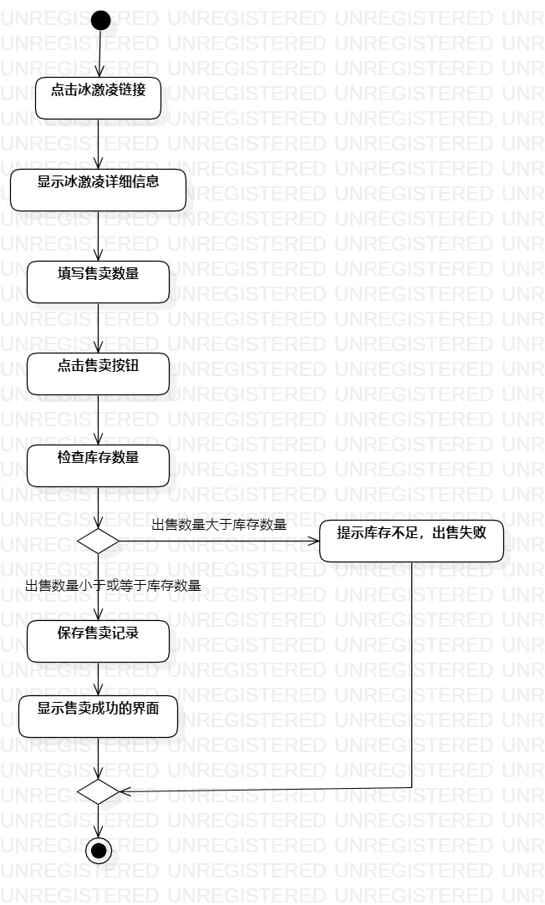
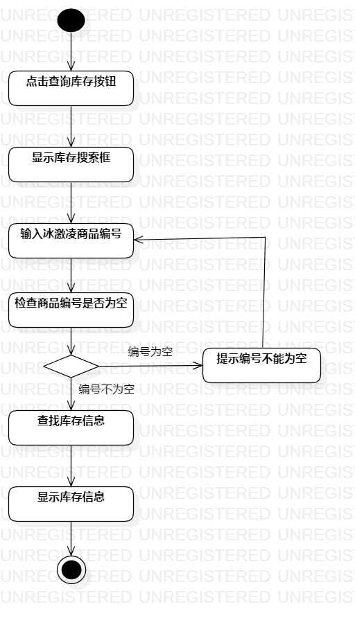
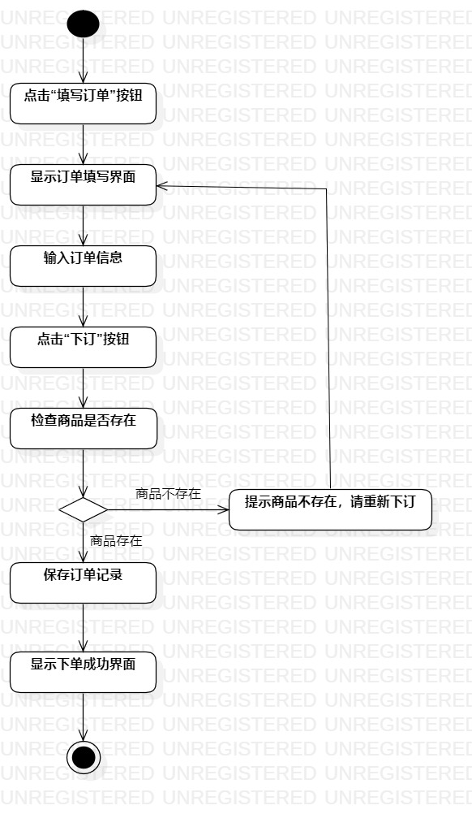

# 实验三：过程建模

## 1. 实验目标

- 掌握过程建模的方法
- 掌握活动图的画法

## 2. 实验内容

- 根据实验二的用例规约绘制活动图
- 编写实验报告

## 3. 实验步骤

- 查看实验二报告中的用例规约
- 创建售卖冰激凌的活动图  
（1）绘制起始节点和结束节点  
（2）根据用例公约添加活动：点击冰激凌链接、显示冰激凌详细信息、填写售卖数量、点击售卖按钮、检查库存数量  
（3）添加决策分支：出售数量小于或等于库存数量、出售数量大于库存数量  
（4）在出售数量小于或等于库存数量的决策分支下面添加活动：保存售卖记录、显示售卖成功的界面  
（5）在出售数量大于库存数量的决策分支下面添加活动：提示库存不足，出售失败  
（6）建立各个决策点、活动和节点之间的关系，用 Control Flow 对各节点进行连线连接   
（7）调整各节点的大小位置，使得活动图更加整齐美观  

- 创建查询库存的活动图  
（1）绘制起始节点和结束节点  
（2）根据用例公约添加活动：点击查询库存按钮、显示库存搜索框、输入冰激凌商品编号、检查商品编号是否为空  
（3）添加决策分支：编号为空、编号不为空  
（4）在编号不为空的决策分支下面添加活动：查找库存信息、显示库存信息  
（5）在编号为空的决策分支下面添加活动：提示编号不能为空  
（6）建立各个决策点、活动和节点之间的关系，用 Control Flow 对各节点进行连线连接  
（7）调整各节点的大小位置，使得活动图更加整齐美观  

- 创建订购冰激凌的活动图  
（1）绘制起始节点和结束节点  
（2）根据用例公约添加活动：点击“填写订单”按钮、显示订单填写界面、输入订单信息、点击“下订”按钮、检查商品是否存在  
（3）添加决策分支：商品存在、商品不存在  
（4）在商品存在的决策分支下面添加活动：保存订单记录、显示下单成功界面  
（5）在商品不存在的决策分支下面添加活动：提示商品不存在，请重新下订  
（6）建立各个决策点、活动和节点之间的关系，用 Control Flow 对各节点进行连线连接  
（7）调整各节点的大小位置，使得活动图更加整齐美观  

## 4. 实验结果

  
图 1 ：售卖冰激凌的活动图

  
图 2 ：查询库存的活动图

  
图 3 ：订购冰激凌的活动图
