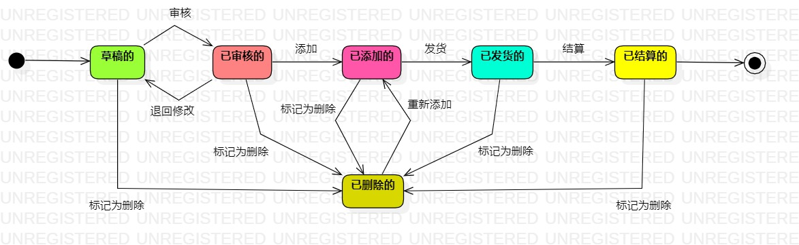

# 实验七：状态建模

## 一、实验目标

1. 掌握对象状态建模（状态图，Statechart）

## 二、实验内容

- 寻找一个关键的对象
- 设计该对象的关键状态
- 设计该对象的转变条件

## 三、实验步骤

1. 根据自己的用例规约、活动图、类图和顺序图，选择学生作为关键的对象  
2. 确定了要绘制状态图的对象是：订单  
3. 找出订单的相关状态：草稿的、已审核的、已添加的、已发货的、已结算的、已删除的  
4. 绘制订单状态图，添加好起始节点和终结节点以及相关的状态节点，最后连线  
5. 提交状态图并撰写实验报告

## 四、实验结果
  
图 1 ：订单状态图
