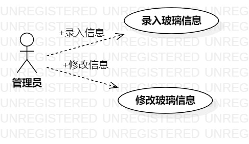

# 实验二

## 一、实验目标
1. 熟悉GitHub实验过程
2. 创建并完善选题

## 二、实验内容
1. 提交选题
2. 说明选题功能需求
3. 画用例图

## 三、实验步骤
1. 确定选题：#438 玻璃制品预约系统
2. 完善功能描述:  
3. Actor 管理员
4. usecase 录入玻璃
  管理员录入玻璃的种类和玻璃单价的信息
5. usecase 修改玻璃
  管理员根据市场的价格的波动，修改出售玻璃的信息
6. 画用例图

## 三、实验结果
图1.玻璃制品预约用例图

## 表1：录入玻璃信息用例规约  

用例编号  | UC01 | 备注  
-|:-|-  
用例名称  | 录入玻璃  |   
前置条件  | 管理员登陆预约系统 | *可选*   
后置条件  |    | *可选*   
基本流程  | 1.管理员点击录入链接； |*用例执行成功的步骤*    
~| 2. 系统显示录入信息页面；  |   
~| 3. 管理员录入玻璃种类信息和玻璃单价，点击完成按钮；  |   
~| 4. 系统检查录入的信息，玻璃种类和单价填写符合规范；  |   
~| 5. 系统保存录入的信息  |   
扩展流程  | 4.1 系统检查发现输入玻璃种类信息不规范，提示“玻璃种类填写不规范”  |*用例执行失败*  
~| 4.2 系统检查发现输入玻璃单价信息不规范，提示“单价信息填写不规范”  |   
## 表2：修改玻璃信息用例规约  

用例编号  | UC02 | 备注  
-|:-|-  
用例名称  | 修改玻璃  |   
前置条件  |  管理员登陆预约系统  | *可选*   
后置条件  |    | *可选*   
基本流程 | 1.管理员点击修改链接；   |   *用例执行成功的步骤*    
~| 2. 系统显示修改玻璃信息页面；  |   
~| 3. 管理员修改玻璃种类和玻璃单价信息，点击完成按钮；  |   
~| 4. 系统检查修改的信息，玻璃种类和单价填写符合规范；  |   
~| 5. 系统提示“修改成功”  |   
扩展流程    | 4.1 系统检查发现输入玻璃种类信息不规范，提示“玻璃种类填写不规范”  |*用例执行失败*  
~| 4.2 系统检查发现输入玻璃单价信息不规范，提示“单价信息填写不规范”  |   
