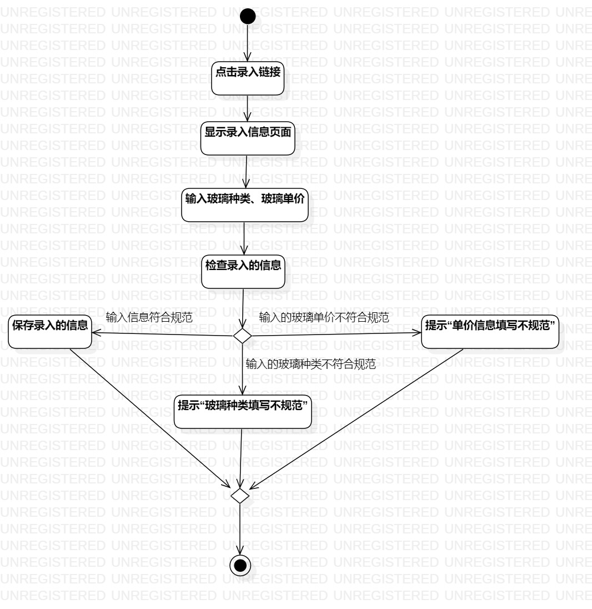
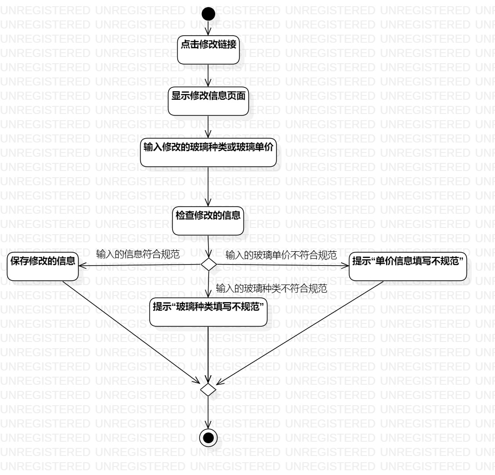

# 实验三：过程建模

## 一、实验目标

1. 掌握过程建模方法
2. 掌握活动图的画法（Activity Diagram）

## 二、实验内容

1. 根据实验二中的用例规约创建活动图

## 三、实验步骤

1. 创建 录入玻璃信息/修改玻璃信息 的活动图
2. 添加initial和final
3. 根据用例规约添加action（eg. 输入玻璃种类、玻璃单价，检查录入的信息..）
4. 在扩展流程的部分添加decision
5. 最后用control flow连接起来
6. 调整图标的位置，让活动图变得更加美观。

## 实验结果

  
图1：录入玻璃的活动图

  
图2：修改玻璃的活动图

