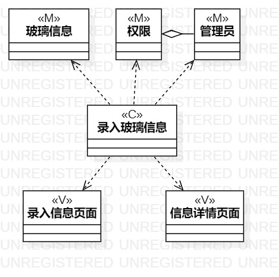
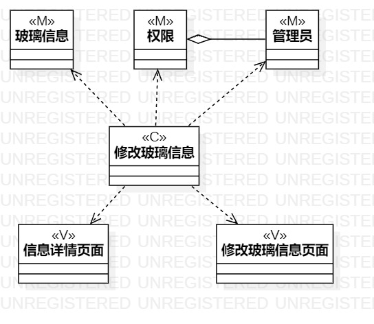

# 实验四五

## 一、实验目标

1. 掌握类建模方法；
2. 了解MVC或你熟悉的设计模式；
3. 掌握类图的画法。（Class Diagram）

## 二、实验内容

1. 基于MVC模式设计类；
2. 设计类的关系；
3. 画出类图

## 三、实验步骤

1. 确定设计模式，选择MVC模式
2. 绘制类图  
    * 确定模型层(Model)：根据用例涉及的数据设计模型类  
    * 确定控制器层(Controller)：根据用例中实现界面与数据层之间交互的方法设计控制器类 
    * 确定视图层(View)：根据用例中使用到的界面设计界面类  
    * 确定类之间关系 
3. 检查类图及类之间的关系，确定以模型中的类能实现用例功能。

## 四、实验结果
  
图1.录入玻璃信息类图

   
图2.修改玻璃信息类图

## 五、实验总结
此次的实验是画出类图，使用的mvc设计模式，也是开发中常用的框架，在这次的实验中把类图中的细节理清，在开发的时候，能够直接借鉴。