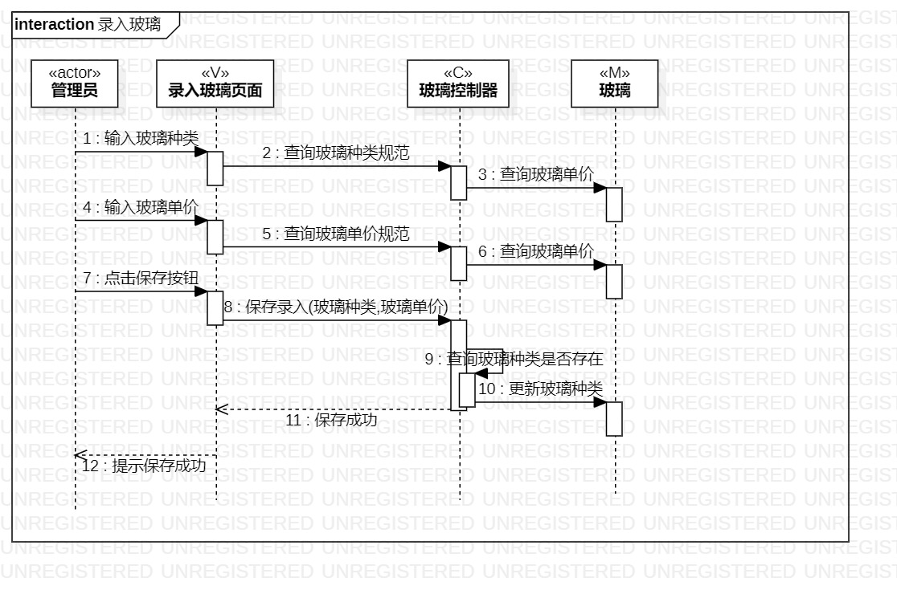
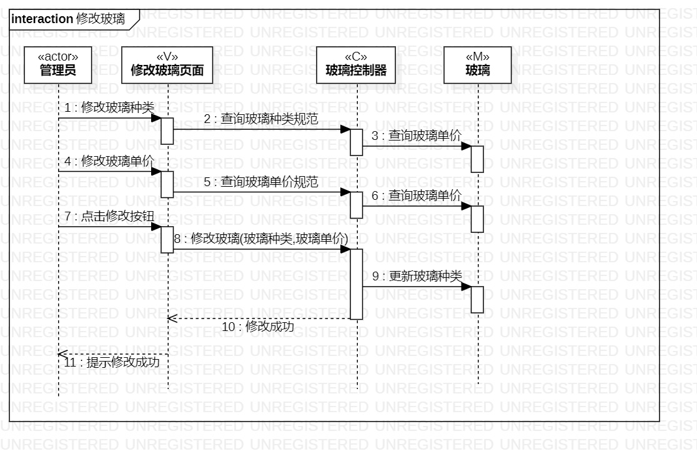

# 实验六：交互建模  

## 一、实验目标

 1.理解系统交互；  
 2.掌握UML顺序图的画法；  
 3.掌握对象交互的定义与建模方法。 

## 二、实验内容

 1. 根据用例模型和类模型，确定功能所涉及的系统对象；
 2. 在顺序图上画出参与者（对象）；
 3. 在顺序图上画出消息（交互）。

## 三、实验步骤

### 先了解什么是顺序图、顺序图的作用还有怎么画
  - 顺序图是将交互关系表示为一个二维图。纵向是时间轴，只代表时间先后而不代表时间跨度。
  - 顺序图可以用来描述Actor和类之间的交互关系。
  - 根据用户和系统的操作，把数据的流向连起来

### 在StarUml中创建顺序图
  1. 在用例图中找到实时操作的Actor
  2. 在类图中找到交互的类
  3. 根据用例规约的操作，画出类之间的交互

### 上传
  - 按以往上传的形式上传

## 四、实验结果

  
图1 录入玻璃顺序图

  
图2 修改玻璃顺序图

## 五、实验感悟
通过这次的实验，更加懂得了老师说这次实验是需要反复修改的。随着uml学习的深入，现在学习到顺序图，才发现之前画的用例图和之前的过程建模都有一些错误需要修改。