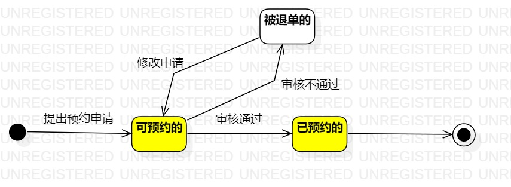

# 实验七：状态建模

## 一、实验目标

1. 掌握状态图及其画法（状态图，Statechart）

## 二、实验内容

1. 寻找1个重要的对象；
2. 寻找这个对象的所有关键状态；
3. 画出状态之间的转换条件。

## 三、实验步骤

1. 寻找一个关键的对象

- 玻璃

2. 设计该对象的关键状态

- 与玻璃预约有关的状态： 可预约的、已预约的、被退单的。

3. 设计状态之间的转变条件
4. 绘制状态图

## 四、实验结果

**图1：玻璃的状态图**