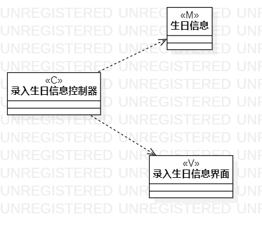

# 实验四

## 实验目标
- 掌握类建模方法；
- 了解MVC或熟悉的设计模式；
- 掌握类图的画法。（Class Diagram）

## 实验内容
- 直接拉入三个class；
- 这三个class分别命名为录入生日信息控制器(c)、生日信息(m)、录入生日信息页面(v)；
- 导出图片，完成了录入生日信息的类图；
- 重复上述步骤完成删除生日信息的类图。

## 实验结果

图1：录入生日信息类图

图2：删除生日信息类图
