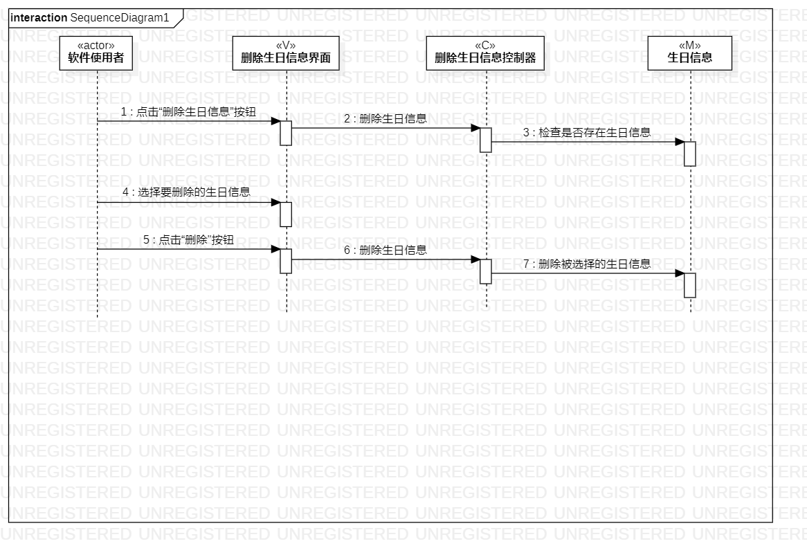

# 实验六

## 实验目标
- 理解系统交互；
- 掌握UML顺序图的画法；
- 掌握对象交互的定义与建模方法。

## 实验内容
- 根据用例模型和类模型，确定功能所涉及的系统对象；
- 在顺序图上画出参与者（对象）；
- 在顺序图上画出消息（交互）。

## 实验步骤
- 右键添加顺序图，并且拉入四个Liftline；
- 给4个Liftline分别命名为录入生日信息对应的actor软件使用者，以及M生日信息，V录入生日信息界面，C录入生日信息控制器；
- 按顺序添加Message分别对应活动图的各个步骤；
- 一样的方法完成删除生日信息顺序图。

## 实验结果

图1：录入生日信息类图

图2：删除生日信息类图
