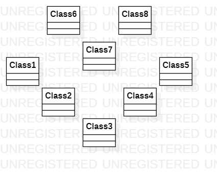

# UML实验一
   
## 实验内容:
   
### 学习和使用Git和UML软件 
   
## 实验步骤： 
   
### 1、下载课程相关软件(git工具及StarUML软件)； 
   
### 2、在github上fork项目后，clone到本地磁盘； 
   
### 3、创建实验文档，用StarUML建立一个uml图，导出成为图片； 
   
### 4、用git上传；
   
### 5、在github上编辑Markdown文档，并插入当前目录下的结果图片； 

### 6、pull request，请求合并到主仓库；  
   
## 实验结果:

