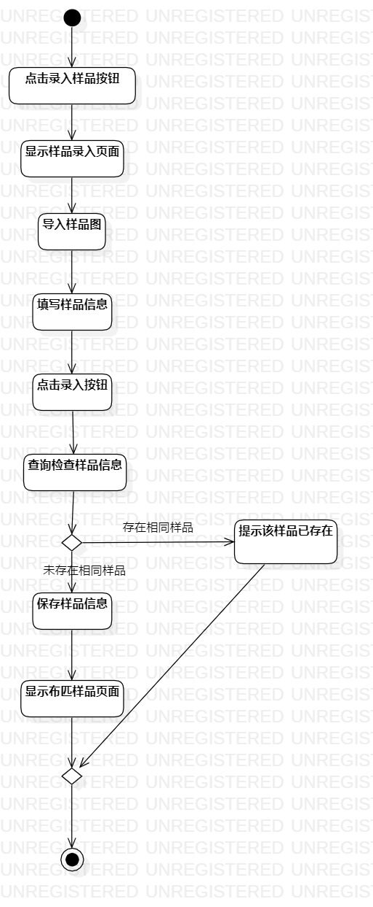
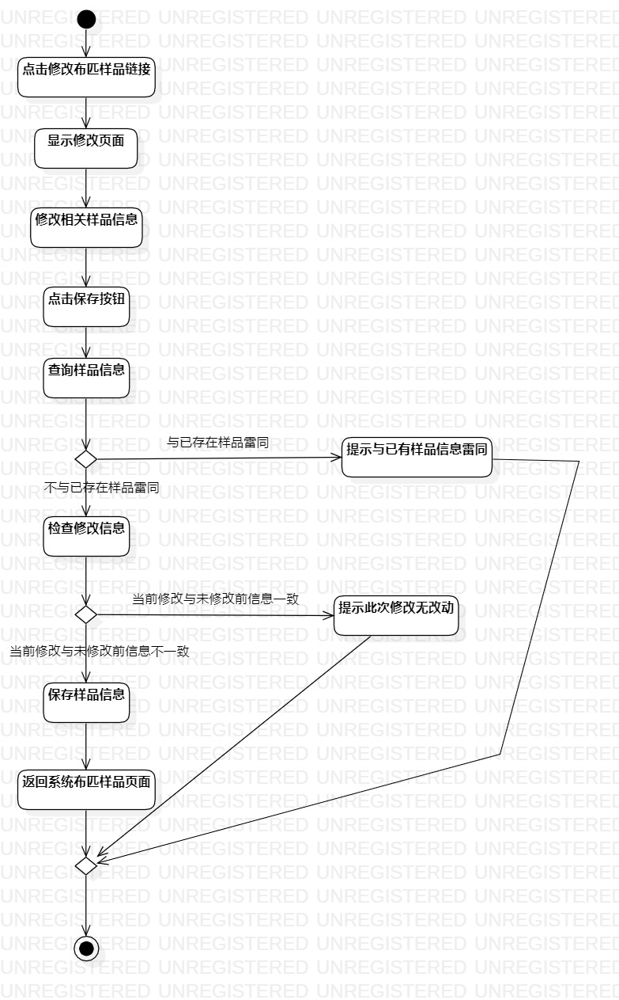

# 实验三：过程建模

## 一、实验目标

1. 掌握过程建模方法
2. 掌握活动图的画法（Activity Diagram）

## 二、实验内容

1. 根据实验二中的用例规约创建活动图

## 三、实验步骤

1. 创建两个活动图：录入布匹样品、修改样品信息两个活动图
2. 添加initial和final
3. 根据用例规约添加action
eg.在录入布匹样品活动图中添加活动：  
    点击录入样品按钮  
    显示样品录入页面  
    导入样品图  
    填写样品信息  
    点击录入按钮  
    ......  
4. 在扩展流程的部分添加decision
5. 最后用control flow连接起来
6. 调整图标的位置使连线不交叉，并尽可能简洁美观

## 四、实验结果

  
图1：录入布匹样品的活动图

  
图2：修改样品信息的活动图

## 五、实验总结
1. 选择Control Flow连线时，不能松开鼠标，不然容易导致连线失败
2. 在实验前要对本地库进行git pull进行同步修改，因为上次在github网站上修改后的文档可能还未更新到本地，容易导致失败。