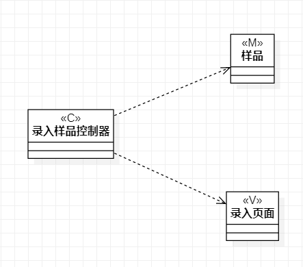

# 实验四：类建模

## 一、 实验目标

1. 掌握类建模方法；
2. 了解MVC或你熟悉的设计模式；
3. 掌握类图的画法。（Class Diagram）

## 二、 实验内容

- 了解并熟悉MVC模式
- 根据实验二的用例规约，画出类图
- 理解类的5种关系
- 熟悉类图的画法

## 三、 实验步骤

### 课程笔记

1. 回顾前两次实验的用例图和活动图
   - 用例图表示系统能提供什么功能；
   - 活动图表示系统的动作是什么；
   - 本次实验的类图表示由谁进行操作，分别有什么操作。
2. 类主要描述了两方面：属性和操作。
3. UML关于类的画法“矩形=名称+属性+操作”（属性和操作可选）。
4. 类的关系有五种，分别为：
   - Dependency
   - Association
   - Aggregation
   - Composition
   - Inheritance     
【建议使用Dependency这种最弱的关系，优点：低耦合。】
5. 对照实验二用例规约，有几个用例画几个类图。
6. 可以使用MVC模式
   - Model 模型 实体 数据
   - View 视图 界面 UI
   - Controller 控制器 服务类 系统  
### 实验操作

1. 创建类图
2. 按照用例规约构造类图
3. 导出图片
4. 提交实验四实验报告

## 四、 实验结果

1. 类图

  
图1. 类图1  
  
图2. 类图2  
