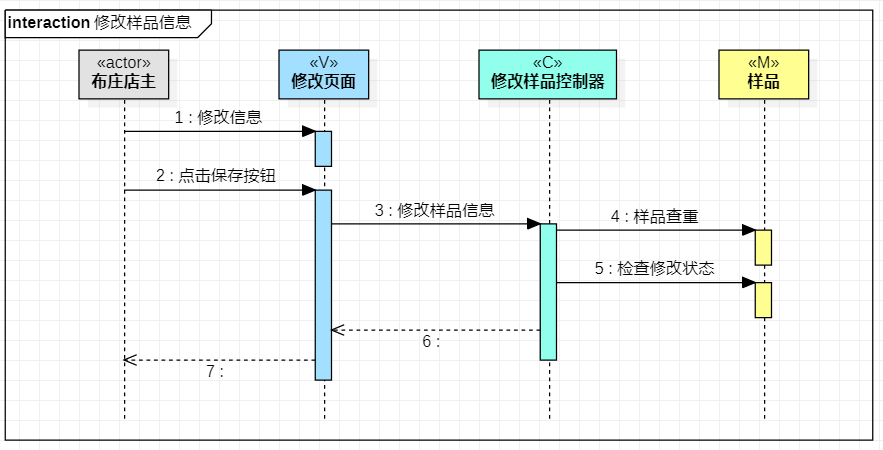

# 实验六：交互建模

## 一、实验目标

1. 理解系统交互
2. 掌握UML顺序图的画法
3. 掌握对象交互的定义与建模方法

## 二、实验内容

1. 根据用例模型和类模型，确定功能所涉及的系统对象
2. 在顺序图上画出参与者（对象）
3. 在顺序图上画出消息（交互）

## 三、实验步骤

### 课堂笔记  
1.  顺序图的构成、及其画法  
    （1）参与者：使用矩形表示  
    （2）生命线：使用竖直的虚线表示  
    （3）事件、信号与消息：用带箭头的线来画，在不同情况下使用不同的线，常使用同步类型  
    （4）存活条/激活条生：使用命线上的矩形表示   
2.  顺序图的“时间顺序”：仅表示前后顺序，不表示时间跨度  
3.  各种消息类型对应的箭头，常见的有同步消息、异步消息和返回消息

### 实验操作
1. 回顾前面实验，修改不合理的用例规约、用例图、活动图和类图
2. 创建录入布匹样品的顺序图
3. 首先查看实验2中的用例规约，查找actor，和根据类图，创建1+N个参与者
4. 根据活动图中的操作流程，精简在顺序图中画出来
5. 创建修改样品信息的顺序图
6. 查找actor，和根据类图，创建1+N个参与者
7. 根据活动图中的操作流程，精简在顺序图中画出来
8. 完成实验报告

## 四、实验结果

  
图1：录入布匹样品的顺序图

  
图2：修改样品信息的顺序图

