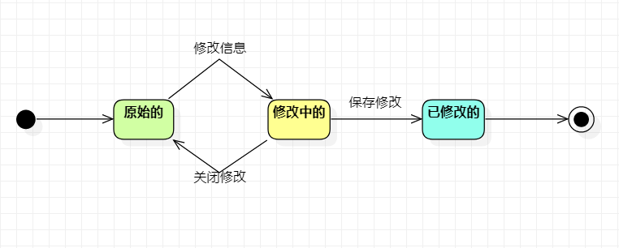

# 实验七：状态建模

## 一、实验目标

1. 掌握对象状态建模（Statechart）

## 二、实验内容

1. 根据用例图、活动图、类图、时序图来绘画状态图;

2. 编写实验报告文档。

## 三、实验步骤

### 课堂笔记

1. 在选取对象时，要考虑对象既要存在于现实、也要存在于计算机内存中了。
2. 实际中，我们通过给对象加上属性来表达状态。
3. 对象的属性中的数据集合发送了变化，也即是对象的状态发送了变化。
4. 易错点：如不可写未创建的（订单状态），因为未创建就是还没存在于内存中，故无状态可言。
5. 状态图画法
    - 找出一个关键的对象;
    - 设计该对象的所有关键状态（使用形容词来表示状态）;
    - 找出状态之间的转变条件。

### 实验步骤

1. 在StarUML上创建试卷状态图（StatechartDiagram.jpg）;
2. 根据系统中已存在的样品，找出"样品"对象的状态;
3. 样品在系统中状态有：原始的、修改中的、已修改的;
4. 编写实验报告文档。

## 四、实验结果

​										
图1：样品的状态图