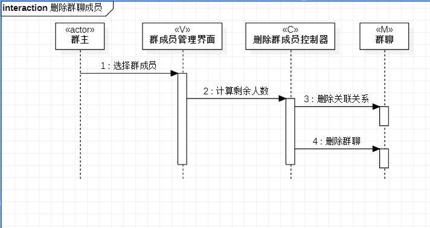
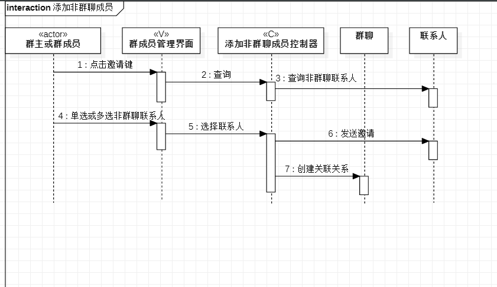

# 实验六：交互建模  

## 一、 实验目标  

#### 1. 理解系统交互；  
#### 2. 掌握UML顺序图的画法；  
#### 2. 掌握对象交互的定义与建模方法。  

## 二、 实验内容  

#### 1. 根据用例模型和类模型，确定功能所涉及的系统对象；  
#### 2. 在顺序图上画出参与者（对象）；  
#### 3. 在顺序图上画出消息（交互）。  

## 三、 实验步骤  

#### 1. 通过视频学习了解交互建模的概念和顺序图的画法；  
#### 2. 通过类图找出参与者；  
#### 3. 通过用例规约画出消息；

#### 4. 在画图过程中对类图进行改进

## 四、 顺序图
删除群成员图
  

添加非群聊成员图
  