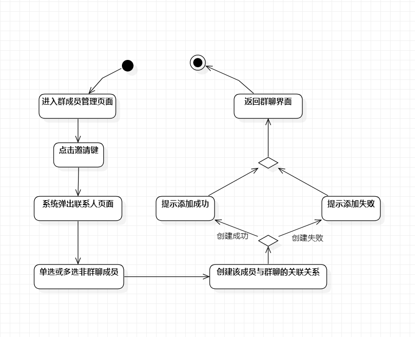

# 实验3 活动建模

## 1. 实验目标

1.  掌握过程建模方法；
2.  掌握活动图的画法。（Activity Diagram）

## 2. 实验内容

- 绘画活动图

## 3. 实验步骤

1. 改进实验2的用例规约
2. 根据改进后的用例规约绘画活动图

4. 实验结果

1. 活动图1——

2. 活动图2——

3. 修改后的用例规约

- 表1：删除群聊中某成员用例规约

用例编号  | UC01 | 备注  
-|:-|-  
用例名称  | 删除群聊中某成员  |   
前置条件  |  群主或群成员进入群聊管理系统   | *可选*   
后置条件  |    | *可选*   
基本流程  | 1. 群主点击进入群成员管理页面；  |*用例执行成功的步骤*    
~| 2. 群主点击选择某一想要从该群聊中删除的成员；  |   
~| 3. 系统计算删除该成员后群聊剩余人数，群聊剩余人数大于1； |
~| 4. 系统删除该成员的群聊关联关系；|
~| 5. 系统提示删除成功并返回群聊页面； |
扩展流程  | 3.1 群聊剩余人数等于1，系统提示如果执行删除该成员操作将解除群聊；  |
| 3.2 确认执行删除成员操作；                                             |*用例执行失败*
|3.3 系统删除所有群聊信息； |
|3.4 返回程序主界面；|

- 表2：添加非群聊成员用例规约

用例编号  | UC02 | 备注  
-|:-|-  
用例名称  | 添加非群聊成员  |   
前置条件  |  群主或群成员进入群聊管理系统  | *可选*   
后置条件  |    | *可选*   
基本流程  | 1. 群主或群成员进入群成员管理页面；  |*用例执行成功的步骤*    
~| 2. 群主或群成员点击邀请键；  |   
~| 3. 系统弹出联系人页面；  |   
~| 4. 群主或群成员单选或多选非群聊成员；  |   
~| 5. 系统发送添加群聊邀请信息给待被选择的非群聊成员； |                                               |
~| 6. 被选择的非群聊成员同意添加群聊邀请信息； |
~| 7. 系统创建该成员与该群聊的关联关系； |  
~| 8. 系统提示群主或群成员添加成功； |
扩展流程  |   5.1 被选择的非群聊成员拒接添加群聊邀请   |
| 5.2 系统提示群主或群成员添加失败 |*用例执行失败*    
