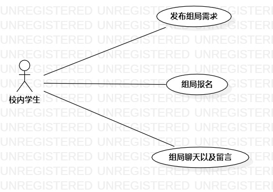

# 实验二：用例建模

## 1.实验目标

1. 细化选题。
2. 编写UML图和markdown报告。

## 2.实验内容

1. 细化功能需求。
2. 画出用例图（Use Case Diagram）。
3. 编写用例规约（表格）。

## 3.实验步骤

1. 确认选题为组局系统（已通过）。
2. 根据选题在starUML上新建用例图。
3. 确认参与者为：校内学生。
4. 根据组局系统功能编写用例：
   * 发布组局需求
   * 组局报名
   * 组局聊天及留言
5. 建立校内学生与用例之间的联系。
6. 导出用例图。
7. 根据用例编写用例规约。

## 4.实验结果

图1：组局系统的用例图

## 表1：发布组局用例规约
用例编号  | UC01 | 备注  
:--|--|-  
用例名称  | 发布组局 |   
前置条件  | 学生进入组局系统 | *可选*   
后置条件  | 学生成功发布组局需求 | *可选*   
基本流程  | 1. 学生点击新建组局按钮； |*用例执行成功的步骤*    
~| 2. 系统显示新建组局页面； |   
~| 3. 学生编写组局相关信息：时间、地点、活动事项、人数限制 ，点击发布按钮； |   
~| 4. 系统查询此学生之前发布的组局信息，检查未存在重复发布的组局信息，保存学生发布的组局信息； |   
~| 5. 系统显示发布成功页面。 |  
扩展流程  | 4.1 系统检查发现此学生此前重复发布过组局信息，不保存学生发布的组局信息 |*用例执行失败*    
 | 5.1 系统显示发布失败页面。 | 

## 表2：组局报名用例规约

用例编号  | UC02 | 备注  
:--|:-|-  
用例名称  | 组局报名 |   
前置条件  | 学生进入组局系统，且组局系统内已存在组局 | *可选*   
后置条件  | 学生成功组局 | *可选*   
基本流程  | 1. 学生点击已存在的组局信息 |*用例执行成功的步骤*    
~| 2. 系统显示组局信息页面； |   
~| 3. 学生点击报名按钮并填写个人信息； |   
~| 4. 系统检查组局人数未满，将学生添加入组局人员； |   
~| 5. 系统显示报名成功页面。 |  
扩展流程  | 4.1 系统检查发现组局人数已满，不可报名。 |*用例执行失败*    
 | 5.1 系统显示报名失败页面。 | 

## 表3：组局留言规约

用例编号  | UC03 | 备注  
:--|:-|-  
用例名称  | 组局留言 |   
前置条件  | 学生进入组局系统，且组局系统内已存在组局 | *可选*   
后置条件  |  | *可选*   
基本流程  | 1. 学生点击已存在的组局； |*用例执行成功的步骤*    
~| 2. 系统显示组局信息页面； |   
~| 3. 学生编写评论询问组局相关信息，点击评论按钮； |   
~| 4. 系统检查评论字数符合字数要求，保存学生发布的留言信息； |   
~| 5. 系统显示评论成功页面，将留言信息发往发布组局的学生。 |  
扩展流程| 4.1 系统检查评论字数超过限制，不保存学生发布的评论信息。 | *用例执行失败* 

