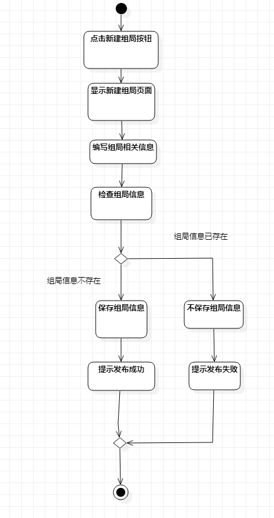

# 实验三

## 实验目标

1. 掌握过程建模方法；
2. 掌握活动图的画法。（Activity Diagram）

## 实验内容

1. 根据用例规约在starUML中画活动图并导出。
2. 编写实验报告。

## 实验步骤

1. 在StarUML中新建Activity Diagram。

2. 根据之前Lab2写的用例规约，画出活动图：
   a). 开始用”initial“实心圆形标志

   b). 具体活动用”Action“圆角矩形，内容对应用例规约的基本流程以及扩展流程。

   c). 遇到条件判断用”Decision”棱形

   d).合并分支用“merge”棱形

   e). 结束用“Final”实心圆形+空心圆形

3. 画完活动图之后选中所有元素，右键format->alignment对齐。

4. 导出UML图并且编写实验报告。

## 实验结果

### 发布组局用例规约activity图

### 组局报名用例规约activity图

### 组局留言用例规约activity图

