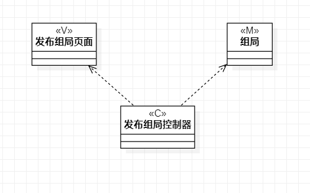
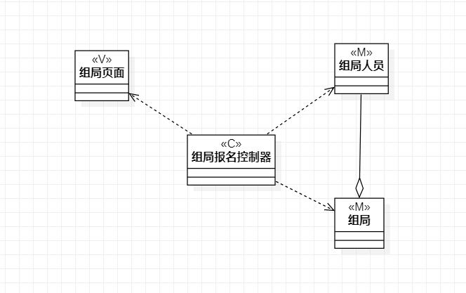
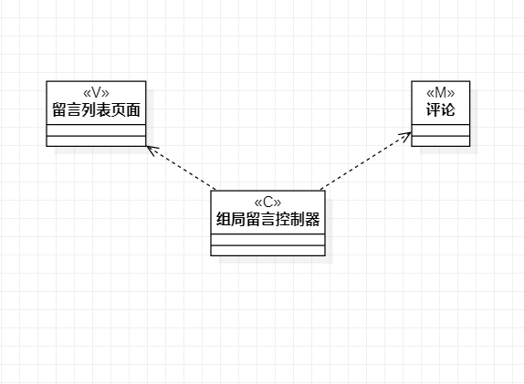

# 实验四、五 类建模

## 实验目标

1. 掌握类建模方法
2. 了解MVC或者你熟悉的设计模式
3. 掌握类图的画法（Class Diagram）

## 实验内容

1. 基于MVC模式设计类
2. 设计类的关系
3. 画出类图

## 实验步骤

1. 观看相关实验视频，了解MVC设计模式：

   ​	

   注意model和view之间不相通

2. 打开starUML新建类图：

   1. 根据Lab2的用例规约确定model，controller，view。具体来说，model就是涉及的数据集合类，controller简单地为用例规约名称，view为显示页面。
   2. 确认它们之间的关系：依赖（dependencey），聚合（aggregation）等
   3. 画出具体类图

3. 导出UML图片并编写实验报告。

## 实验结果

图1.发布组局类图

图2.组局报名类图

图3.组局留言类图