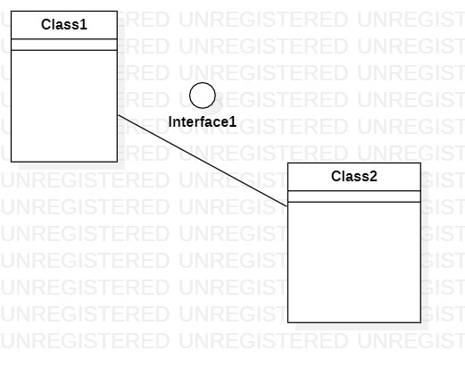

# 实验一

## 实验目标

1.学会使用git以及GitHub

2.学会将starUML的图导出并添加到实验报告里面（markdown语法）

## 实验内容

1. 用starUML绘制UML图并导出。
2. 编写实验报告。
3. 在GitHub上提交实验报告和UML图

## 实验步骤

1. 下载并安装Git， starUML。
2. 登录GitHub将uml-modeling-2020 fork至自己仓库，同时用git clone命令克隆一份项目副本到本地磁盘。
3. 在本地项目副本的students目录下新建一个以自己学号命名的文件夹。
4. 使用starUML绘制第一个UML图并导出至文件夹。
5. 在文件夹下新建一个lab1.md，编写实验报告并保存。
6. 通过git add， git commit，git push命令更新位于GitHub的远程库。
7. pull request申请与主项目合并。

## 实验结果

