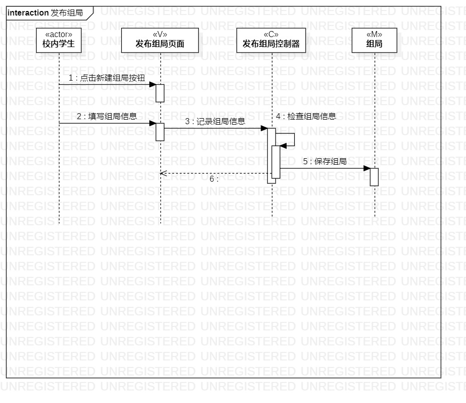
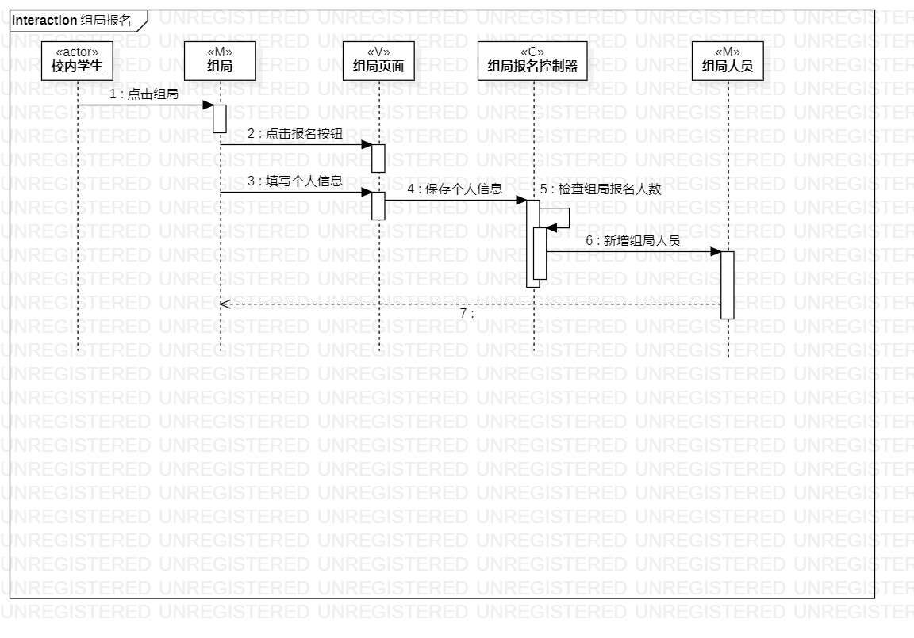
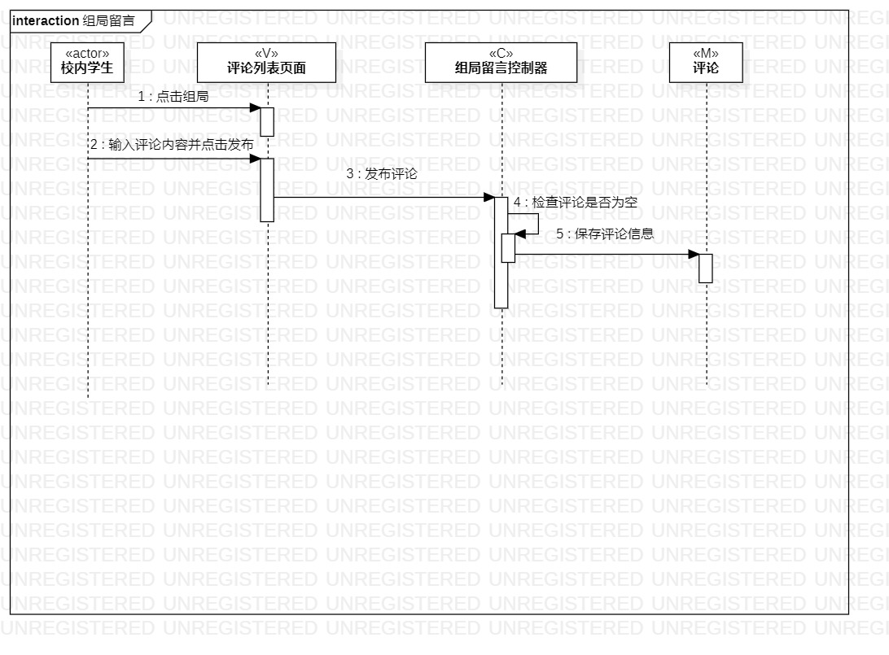

# 实验六：交互建模

## 实验目标

1. 理解系统交互；
2. 掌握UML顺序图的画法；
3. 掌握对象交互的定义与建模方法。

## 实验内容

1. 根据用例模型和类模型，确定功能所涉及的系统对象
2. 在顺序图上画出参与者（对象）；
3. 在顺序图上画出消息（交互）。

## 实验步骤

1. 观看视频，了解相关概念；
2. 打开starUML，新建顺序图：
   * 根据用例图以及类图，确定参与者并添加消息
   
   * 考虑用例图和类图中一些不合理的地方，重新进行改写：
   
     具体如下：
   
     1. Lab2更改用例名称及部分用例规约流程，使其更加简练、合理。
     2. 根据更改后的Lab2改正相应Lab3的用例规约的活动图。
     3. Lab4更改类图，使其更加简练。
   
3. 导出UML图片并编写实验报告。

## 实验结果

图1：发布组局顺序图

图2：组局报名顺序图

图3：组局留言顺序图