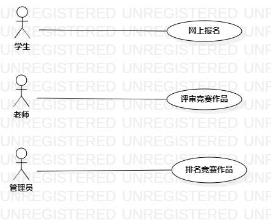

# 实验二：用例建模

## 一、实验目标
1. 学习并掌握用例建模的基本概念
2. 细化选题
3. 了解并掌握用例图的画法
4. 编写用例规约
## 二、实验内容
1. 分析功能需求
2. 使用StarUML创建用例图
3. 编写用例规约
## 三、实验步骤
1. 创建个人选题：学科竞赛管理系统
2. 创建学科竞赛管理系统用例图
3. 编写学科竞赛管理系统用例规约
## 四、实验结果
1. 用例图

图1. 学科竞赛管理系统用例图

## 表1：网上报名用例规约  

用例编号  | UC01 | 备注  
-|:-|-  
用例名称  | 网上报名  |   
前置条件  | 学生登入学科竞赛管理系统     | *可选*   
后置条件  |      | *可选*   
基本流程  | 1. 学生点击报名按钮；  |*用例执行成功的步骤*    
~| 2. 系统显示报名页面；  |   
~| 3. 学生输入个人报名信息并且上传竞赛作品文件，点击提交按钮；  |   
~| 4. 系统**查询到**学生信息，检查个人报名信息与学生信息**相匹配**，检查上传文件格式正确，系统保存学生个人报名信息和所上传文件 ； |   
~| 5. 系统显示报名成功页面。  |  
扩展流程  | 4.1 系统检查发现个人报名信息和学生信息不匹配，**提示“信息填写不正确”**；  |*用例执行失败*    
~| 4.2 系统检查发现文件格式不正确，**提示“文件格式不正确”**。  |  

## 表2：评审竞赛作品用例规约  

用例编号  | UC02 | 备注  
-|:-|-  
用例名称  | 评审竞赛作品  |   
前置条件  | 老师登入学生竞赛管理系统    | *可选*   
后置条件  |      | *可选*   
基本流程  | 1. 老师点击评审按钮；  |*用例执行成功的步骤*    
~| 2. 系统显示学生作品页面；  |   
~| 3. 老师评审作品并打分、填写评审人名称，点击提交按钮；  |   
~| 4. 系统检测所有作品打分完毕，评审人名称填写正确，系统保存评审人名称和所有打分分数 |   
~| 5. 系统显示评审成功页面。  |  
扩展流程  | 4.1 系统检查发现作品没有全部打分，**提示“作品未全部打分”**；  |*用例执行失败*    
~| 4.2 系统检查发现评审人名称填写不正确，**提示“评审人名称填写不正确”**。  |  

