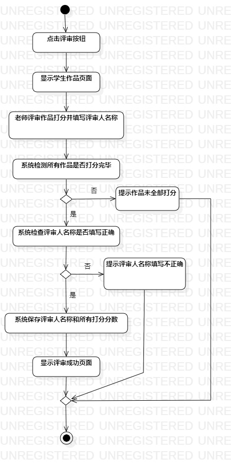

# 实验三：过程建模

## 1.实验目标

- 理解过程建模的概念
- 参照用例做出过程建模

## 2.实验内容

-做出自己用例的过程建模

## 3.实验步骤

- 创建Initial的起点图标
- 根据用例规约的基本流程使用Action
- 使用Decision标示扩展流程
- 使用Final图标表示结束

## 4.实验结果
   
  
  图1.网上报名过程图

   
 
  图2.评审竞赛作品过程图
