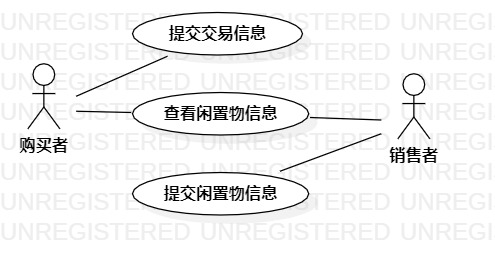

# 实验二

## 一、实验目标

1. 熟悉熟悉GitHub实验过程
2. 创建并完善选题

## 二、实验内容

1. 提交选题
2. 说明选题功能需求
3. 画用例图

## 三、实验步骤

1. 确定选题：#390 闲置物出售平台
2. 完善功能描述:  
(1) 用户有自己的个人信息（包括姓名，性别，年龄，信誉值，交易次数，使用该平台的时间）  
(2) 用户能提交自己的闲置物信息（包括闲置物名称，商品描述，价格，交易手段等等）  
(3) 用户能浏览别人的个人信息和闲置物信息
3.画用例图

## 四、实验结果

1. 项目用例图

  
图1. 项目用例图
