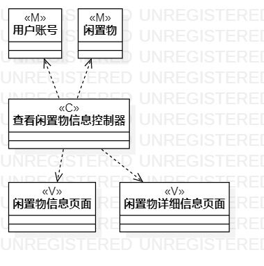
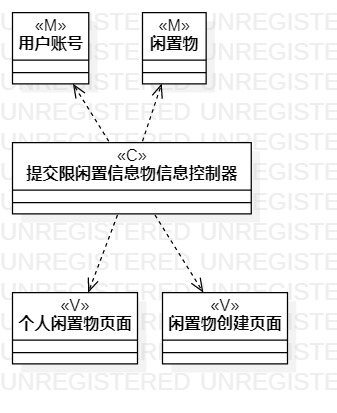
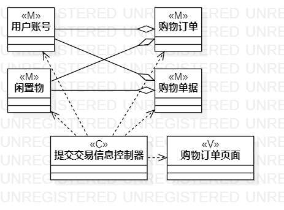

# 实验四、五

## 一、实验目标

1. 掌握类建模方法；
2. 了解MVC或你熟悉的设计模式；
3. 理解类的5种关系；
4. 掌握类图的画法。（Class Diagram）

## 二、实验内容

1. 基于MVC模式设计类；
2. 设计类的关系；
3. 画出类图。

## 三、实验步骤

1. 根据“查询闲置物信息用例”绘制类视图：

(1) 创建类： 
- M : 闲置物。
- C : 查看闲置物信息控制器。
- V : 闲置物信息页面、闲置物详细信息页面。

(2) 绘制类间关系。 

2. 根据“提交闲置物信息用例”创建类： 

(1) 创建类： 
- M : 用户账号、闲置物。
- C : 提交闲置物信息控制器。
- V : 个人闲置物信息页面、闲置物创建页面。

(2) 绘制类间关系。

3. 根据“提交订单用例”创建类： 

(1) 创建类： 
- M : 用户账号、闲置物、购物订单。
- C : 提交交易信息控制器。
- V : 购物订单显示页面。

(2) 绘制类间关系。 

## 四、实验结果

  
图1  查看闲置物信息的类图

  
图2  提交闲置物信息的类图

  
图3  提交订单的类图
