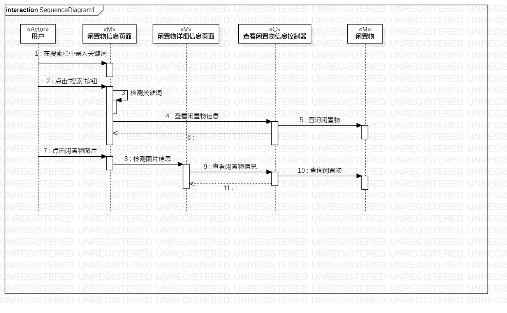
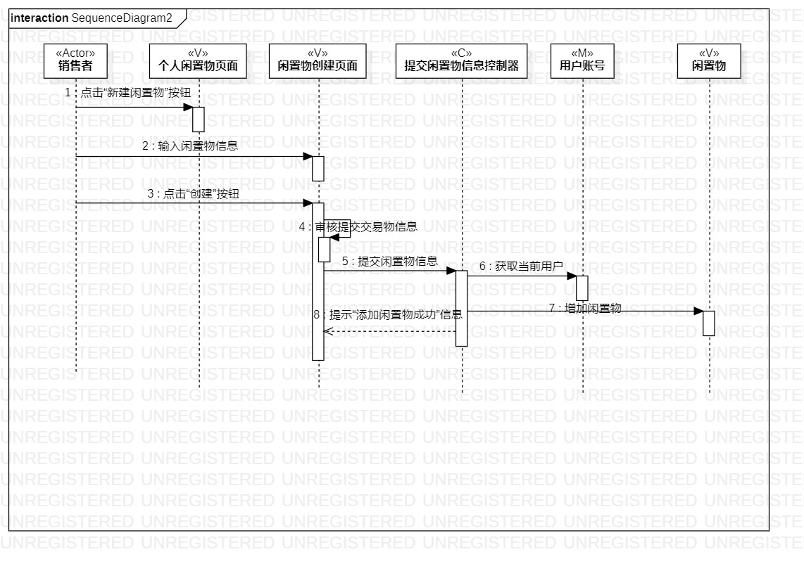
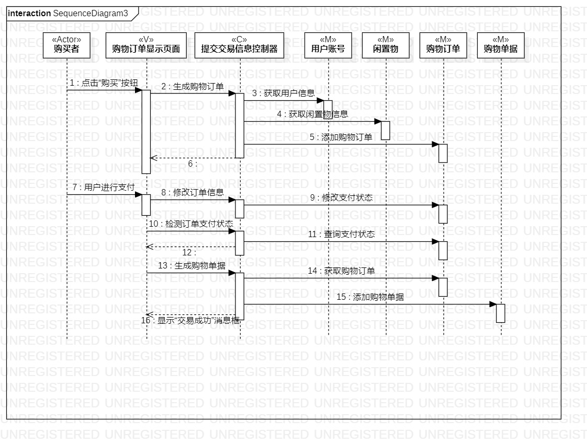

# 实验六

## 一、实验目标

1. 理解系统交互；
2. 掌握UML顺序图的画法；
3. 掌握对象交互的定义与建模方法。

## 二、实验内容

1. 修正用例规约、活动图、类图
2. 根据用例规约、活动图、类图绘制顺序图

## 三、实验步骤

(1) 更新提交闲置物信息用例、查看闲置物信息用例、提交订单用例
- 删除多余操作、改正错误操作

(2) 更新提交闲置物信息活动图、查看闲置物信息活动图、提交订单活动图
- 更加用例进行了修改

(3) 更新提交闲置物信息类图、查看闲置物信息类图、提交订单类图
- 其中包括对类图的布局调整以及删减

(4) 根据用例规约、类图确认顺序图的参与者以及其他对象

(5) 绘制顺序图中的消息。 

## 四、实验结果

  
图1  查看闲置物信息的顺序图

  
图2  提交闲置物信息的顺序图

  
图2  提交订单的顺序图
