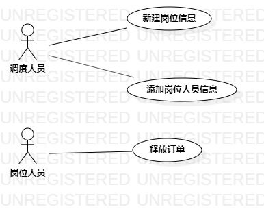

# 实验二

## 一、实验目标
1. 确定issue选题

2. 确定2~3个用例，并进行用例建模

3. 编写用例规约

## 二、实验内容
1. 确定并上传issue选题

2. 运行StarUML软件完成用例图并导出为jpg图片

3. 编写用例规约

4. 完成实验报告

## 三、实验步骤
1. 确定自己的选题为京东订单多维度调度系统

2. 确定用例为新建岗位信息、添加岗位人员信息、释放订单并制成用例图

3. 根据用例图编写用例规约

## 四、实验结果

1. 画用例图

    图一：京东订单多维度调度系统用例图

2. 编写用例规约

表1：新建岗位信息用例规约  

用例编号  | UC01 | 备注  
-|:-|-  
用例名称  | 新建岗位信息  |   
前置条件  |   调度人员进入新建岗位页面   |    
后置条件  |  显示岗位列表    |    
基本流程  | 1. 调度人员点击新建岗位按钮 |       
~| 2. 系统显示新建岗位页面 |   
~| 3. 调度人员填写岗位名称、所属分公司、备注等必填信息  |   
~| 4. 系统检测必填信息已全部填写，显示“新建成功，请检查所填信息是否有误”  |   
~| 5. 调度人员检查信息无误，点击“保存”按钮  |    
~| 6. 系统保存新建岗位信息，并显示岗位列表，同时新建的岗位所在行显示变更人ID和变更时间字段值 |
扩展流程  | 4. 系统检测必填信息未全部填写，显示“新建失败，请确认必填信息已全部填写”，返回新建岗位页面 |    

表2：添加岗位人员信息  

用例编号  | UC02 | 备注  
-|:-|-  
用例名称  | 添加岗位人员信息  |   
前置条件  |   调度人员进入添加岗位人员页面   |    
后置条件  | 显示岗位人员列表     |    
基本流程  | 1. 调度人员点击添加岗位人员按钮 |       
~| 2. 系统显示添加岗位人员页面 |   
~| 3. 调度人员填写ERP账号、账号操作人的姓名等必填信息 |   
~| 4. 系统检测必填信息已全部填写，显示“添加成功，请检查所填信息是否有误”  |   
~| 5.  调度人员检查信息无误，点击“保存”按钮 |    
~| 6.  系统保存岗位新添加的人员信息，并显示该岗位的人员列表，同时新添加的人员所在行显示变更人ID和变更时间字段值 |   
扩展流程  | 4. 系统检测必填信息未全部填写，显示“添加失败，请确认必填信息已全部填写”，返回添加人员页面 |    

表3：释放订单 

用例编号  | UC03 | 备注  
-|:-|-  
用例名称  | 释放订单 |   
前置条件  |   调度人员部分订单的领取时长已超过调度页面的有效期，即订单过期  |    
后置条件  |  系统提示“释放成功” |    
基本流程  | 1. 系统监控调度人员的订单领取时长，发现当前订单已过期 |       
~| 2. 系统提示调度人员释放订单 |   
~| 3. 调度人员点击“确定释放”按钮 |   
~| 3. 系统释放未调度订单到调度队列，同时删除调度人员的个人队列 |   
~| 4. 系统提示“释放成功”  |     
扩展流程  |  |    
