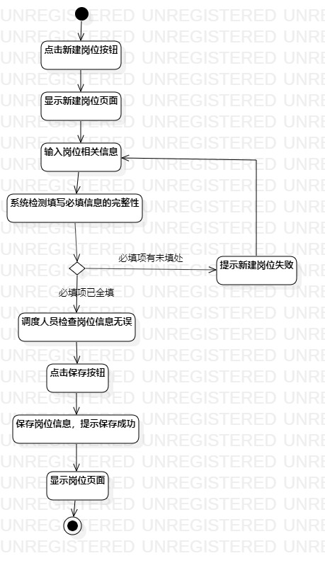
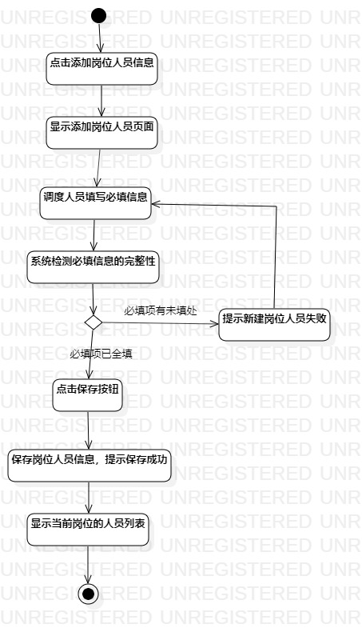
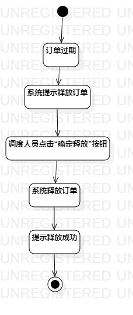

# 实验三：过程建模

## 一、实验目标

1、掌握过程建模方法

2、掌握活动图的画法（Activity Diagram）

## 二、实验内容

1、掌握过程建模的方法

2、运用StarUML绘制实验二用例规约的活动图

## 三、实验步骤

1、观看视频，初步掌握使用StarUML软件绘制活动图

2、新建活动图

3、打开实验二，参照新建岗位用例规约并绘制新建岗位活动图，同时按需求更改新建岗位用例规约

- 添加“Initial”和“Final”

- 添加多个“Action”，分别输入新建岗位用例规约中的相关操作

- 添加多个“Decision”，使用连接线将各个组件连接起来

4、使用第3点的方法绘制“新建岗位人员的活动图”和“释放订单的活动图”

## 四、实验结果

### 活动图如下：

图1：新建岗位的活动图

图2：新建岗位人员的活动图

图3：释放订单的活动图
