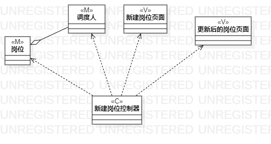
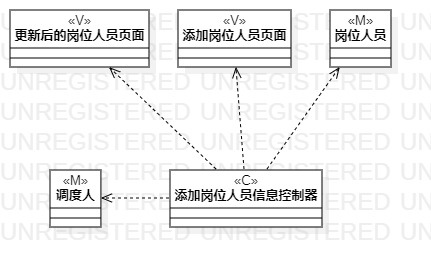
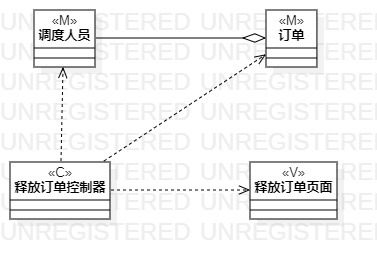

# 实验四：类建模 实验五：高级类建模

## 一、实验目标

1、掌握类建模方法

2、了解MVC或你熟悉的设计模式

3、掌握类图的画法（Class Diagram）

## 二、实验内容

1、基于MVC模式设计类

2、设计类的关系

3、画出类图

## 三、实验步骤

2、在StarUML中新建类图

3、打开实验二，根据三个用例规约分别找出所有的类图

4、用class组件画出类图，类图组成元素包括实体、控制器与界面

5、确定各个类图中各class的关系，用Aggregation与Dependency连接

6、撰写实验报告

## 四、实验结果

### 类图如下：

图1：新建岗位类图

图2：新建岗位人员类图

图3：释放订单类图
