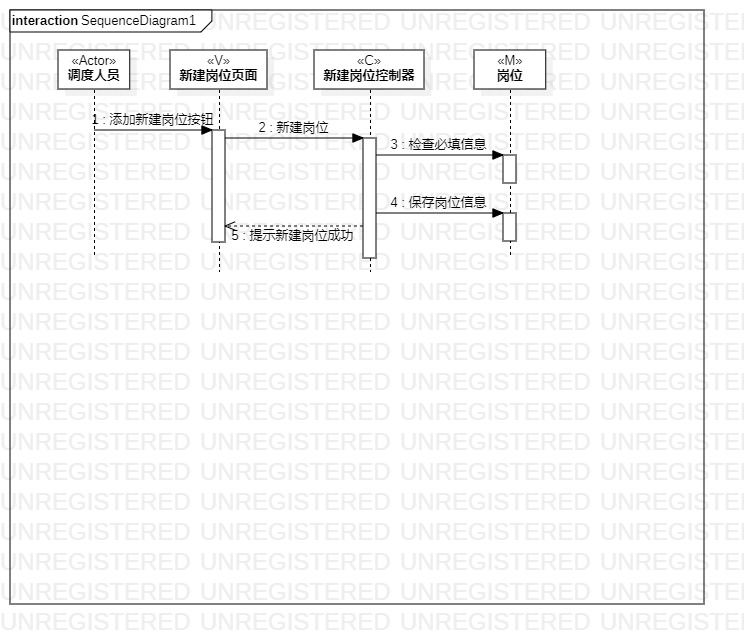
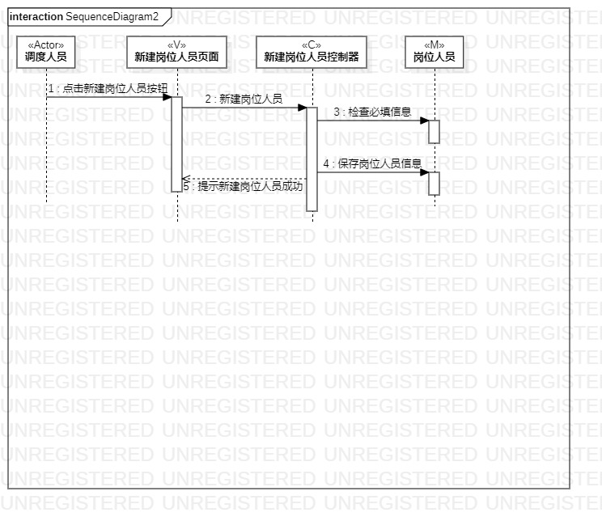

# 实验六：交互建模

## 一、实验目标

1. 理解系统交互

2. 掌握UML顺序图的画法

3. 掌握对象交互的定义与建模方法

## 二、实验内容

1. 根据用例模型和类模型，确定功能所涉及的系统对象

2. 在顺序图上画出参与者（对象）

3. 在顺序图上画出消息（交互）

## 三、实验步骤

1. 打开实验二用例图及用例规约，实验三活动图，实验四五类图

2. 在StarUML软件中新建顺序图

3. 根据实验二中的用例图，可以找出actor

4. 根据实验四五类图，在顺序图中创建N+1个参与者

5. 根据实验三活动图，在顺序图中画出参与者的关系

6. 提交顺序图到GitHub上并撰写实验报告

## 四、实验结果

### 顺序图如下：

图1：新建岗位顺序图

图2：新建岗位人员顺序图

图3：释放订单顺序图
