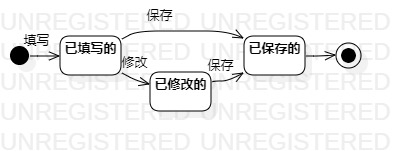

# 实验七：状态建模

## 一、实验目标

- 掌握对象状态建模（状态图，Statechart）

## 二、实验内容

1. 根据用例图、用例规约、活动图、类图、顺序图，确定关键对象

2. 画出状态图

## 三、实验步骤

1. 根据先前实验完成的用例图、活动图、类图、顺序图，进一步确定系统的关键对象为岗位

2. 找出岗位的一系列状态为如下：

- 已填写的

- 已修改的

- 已保存的

3. 打开StarUML软件，新建Statechart图，在图中添加“Initial State”、“Final State”、“Simple State”

4. 确定岗位的各个状态之间的转换以及转换条件

5. 保存岗位的状态图并提交至GitHub，同时完成实验文档

## 四、实验结果

### 状态图如下：

图1：岗位的状态图
