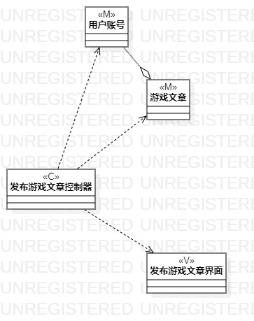
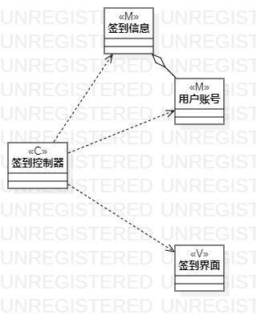

# 实验四：类建模

## 1.实验目标

- 掌握类建模
- 了解MVC或你熟悉的设计模式
- 掌握类图的画法（Class Diagram)

## 2.实验内容

- 基于MVC模式设计类
- 设计类的关系
- 画出类图

## 3.实验步骤

- 创建签到的类图项目
- 创建签到控制器类图，签到界面类图，用户账号类图，签到信息类图。
- 用依赖线连接签到控制器类图和其他的类图，使用聚合线连接账号类图，签到信息类图
- 创建游戏发布文章类图项目
- 创建发布文章控制器类图，发布游戏文章界面类图，用户账号类图，游戏文章类图。
- 用依赖线连接预约发布文章控制器类图和其他类图，使用聚合线连接用户账号类图，游戏文章类图。

## 4.实验结果

 

  图1.发布游戏文章类图

   

  图2.签到类图
