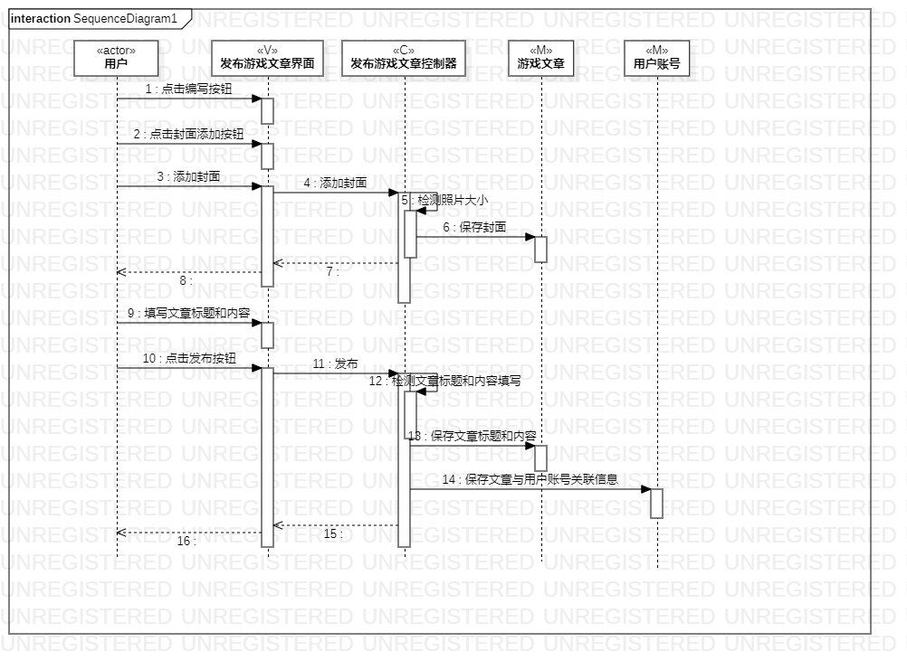
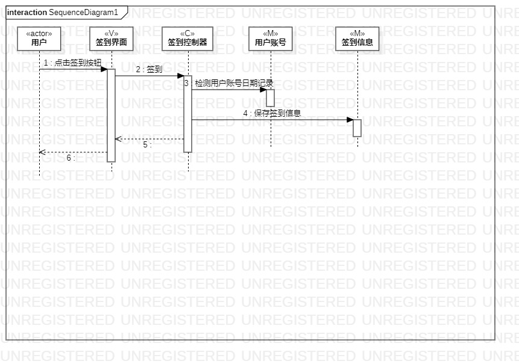

# 实验六：交互建模

 ## 一、实验目标

 1. 理解系统交互

 2. 掌握UML顺序图的画法

 3. 掌握对象交互的定义与建模方法

 ## 二、实验内容

 1. 根据用例模型和类模型，确定功能所涉及的系统对象

 2. 在顺序图上画出参与者（对象）

 3. 在顺序图上画出消息（交互）

 ## 三、实验步骤

 1.  创建“发布文章”的顺序图
 2.  根据类图创建（4+1）参与者：
 * 用户（actor)  
 * 游戏文章（M）
 * 用户账号（M）
 * 发布游戏文章界面（V）  
 * 发布游戏文章控制器（C） 
 3.  根据活动图找出操作流程

 4.  创建“签到”的顺序图

 5.  根据类图创建（4+1）参与者：  
 * 用户（actor)  
 * 签到信息（M）
 * 用户账号（M） 
 * 签到界面（V）   
 * 签到控制器（C）   

 6.  然后同样根据活动图找出操作流程，在顺序图画出参与者之间的联系

 ## 四、实验结果

   
 图1：发布文章顺序图

   
 图2：签到顺序图
