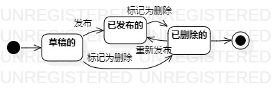
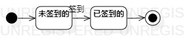

# 实验七：状态建模

 ## 一、实验目标

 1、掌握对象状态建模      

 ## 二、实验内容

 1、根据用例模型和类模型，确定功能所涉及的系统对象   
 2、在状态图上画出状态   
 3、在状态图上画出状态转变的条件   

 ## 二、实验步骤

 1.在活动图和类图中找出对象(游戏文章)

 2.设计该对象的关键状态(草稿的，发布的，删除的)

 3.设计状态之间的转变条件
 
 4.在活动图和类图中找出对象(签到信息)

 2.设计该对象的关键状态(未签到的，已签到的)

 3.设计状态之间的转变条件
 ## 三、实验结果

   
 图1.游戏文章的状态图 
 
    
 图1.签到信息的状态图 
 
 
