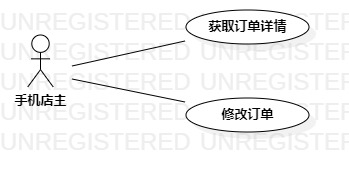

# 实验二 用例建模

## 1 实验目的
1.1 加强github的使用   
1.2 学会画用例图  
1.2 编写用例规约   
## 2 实验内容   
2.1 创建用例图  
2.2 编写用例规约
## 3 实验步骤
3.1  首先在issue里提交自己的选题和功能介绍  
3.2  题目是#1087 手机商品订单管理系统    
3.3  创建用例图      
（1）确认参与者：手机店主  
（2）添加用例：获取订单详情，修改订单       
（3）使用StartUML画出用例图       
3.4 编写用例规约   
（1）编写获取订单详情用例规约    
（2）编写修改订单用例规约    
## 4 实验结果  
  
 图1：手机商品订单管理系统用例图     

## 表1：获取订单详情用例规约  

用例编号  | UC01 | 备注  
-|:-|-  
用例名称  | 获取订单详情  |   
前置条件  |   手机店主有订单   | *可选*   
后置条件  |      | *可选*   
基本流程  | 1. 手机店主点击订单未出货订单按钮 |*用例执行成功的步骤*   
~| 2. 系统查询未出货订单列表  |
~| 3.1. 查询结果为空，系统提示“没有订单”|
~| 3.2. 查询结果不为空，系统显示订单列表，进入步骤4  | 
~| 4. 手机店主点击列表项  | 
~| 5. 系统查询订单详细  |
~| 6. 系统显示订单信息页面|
扩展流程  | |*用例执行失败*        

## 表2：修改订单用例规约  

用例编号  | UC02 | 备注  
-|:-|-  
用例名称  |修改订单信息 |   
前置条件  |  系统显示订单详情页面    | *可选*   
后置条件  |      | *可选*   
基本流程  |1. 手机店主点击修改订单按钮 |*用例执行成功的步骤*    
~| 2. 系统查询订单详细 |
~| 3. 系统显示可修改订单信息页面 |
~| 4. 手机店主输入订单信息 |
~| 5. 手机店主点击完成按钮|
~| 6. 系统更新订单详细，提示“修改订单成功”  |  
扩展流程  | 5.1.  系统检测订单信息输入的内容为空 ，提示“输入内容不能为空”|*用例执行失败* 
~| 5.2. 返回步骤4 |
~| 5.3. 系统检测订单信息输入的内容不合法，提示“输入内容不合法” |
~| 5.4. 返回步骤4 |

## 5 实验总结
1. 用例规约编写要写清楚系统的关键行为。
2. 用例规约编写要清楚判断的条件，前一步的关键行为会产生什么不同的结果。
3. 分清用例执行失败的条件是什么，阻止用例执行的因素有哪些？