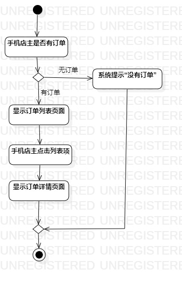
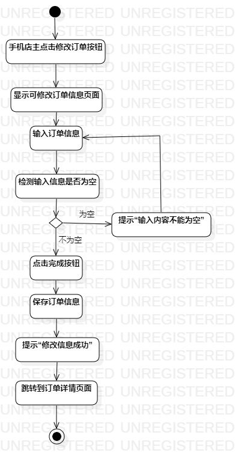

# 实验三：过程建模

## 一.实验目标

1. 掌握过程建模方法
2. 掌握活动图的画法

## 二.实验内容

根据实验二中的用例规约创建活动图。

## 三.实验步骤

1. 观看老师视频，熟悉活动图（Activity Diagram）的符号及其用法。
2. 在StarUML创建Activity Diagram。
3. 添加Initial结点。
4. 根据实验二中的用例规约添加Action和Decision
5. 边画边思考用例规约的每一步。
6. 发现错误或不足，修改第二次实验的用例规约。
7. 完善活动图。
8. 提交活动图图到GitHub上并撰写实验报告。

## 四.实验结果

  
图1：获取订单详情活动图  

   
图2：修改订单活动图  

## 五.实验总结
1. 仔细分析条件判断的前一步关键行为有没有其他的结果。
2. 系统的关键行为要画出来。
3. 依照用例规约画活动图，边画边思考，不断完善用例规约。