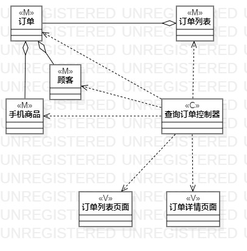
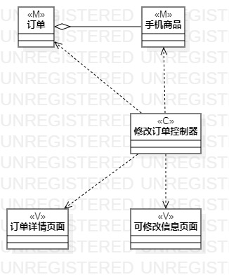

# 实验四五：类建模

## 一、实验目标

1. 掌握类建模方法。
2. 掌握类图的画法。（Class Diagram）
3. 了解MVC设计模式。

## 二、实验内容

1. 根据用例规约图中的基本流程和扩展流程设计类。
2. 基于MVC设计模式画出类图。

## 三、实验步骤

1. 先确定整个用例所设计到的类、试图和控制器。
2. 根据用例规约添加相应的类、试图和控制器。
3. 分析各个类之间的关系。
4. 给每个类、试图和控制器连接建立关系。
5. 完善类图。
6. 提交类图到GitHub上并撰写实验报告。

## 四、实验结果

  
图1：获取订单详情类图 
 
   
图2：修改订单活类图  

## 五.实验总结
1. 深刻理解类和类的属性。像类与类之间是聚合还是继承或者说是联合(association)。
2. 从需求分析中深度挖掘需要的类。