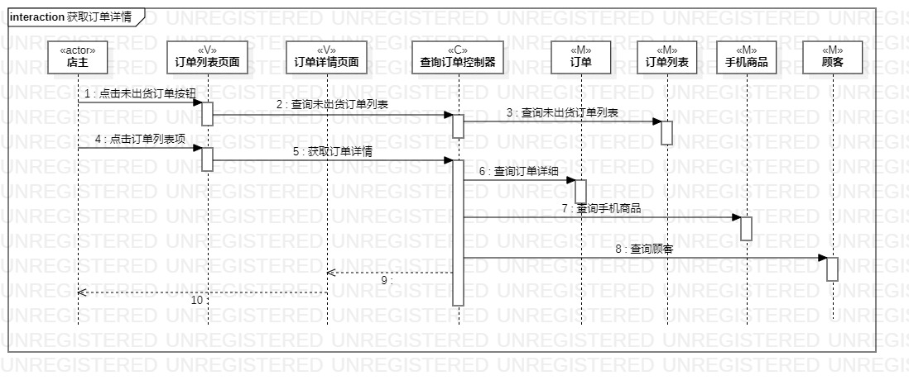
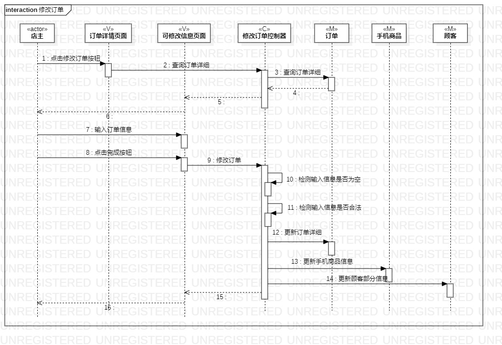

# 实验六：交互建模

## 一、实验目标

1. 理解系统交互。
2. 掌握UML顺序图的画法。
3. 掌握对象交互的定义与建模方法。

## 二、实验内容

1. 根据用例模型和类模型，确定功能所涉及的系统对象。
2. 在顺序图上画出参与者（对象）。
3. 在顺序图上画出消息（交互）。

## 三、实验步骤

1. 打开实验二用例规约，实验三活动图，实验四五类图。
2. 根据视频内容和前面的实验绘制画顺序图。
3. 在StarUML中新建Sequence Diagram。
4. 查看实验二用例规约，查找actor，以及根据实验四五类图，创建N+1个参与者。
5. 根据实验三活动图的操作流程，在顺序图中画出与参与者的关系。
6. 发现错误或不足修改之前的实验。
7. 完善顺序图。
8. 提交顺序图到GitHub上并撰写实验报告。

## 四、实验结果

  
图1：获取订单详情顺序图 
 
   
图2：修改订单顺序图  

## 五.实验总结
1. 不被其他的程序设计思维限制到自己的系统分析与设计。
2. 清楚理解各个类之间的联系和控制器怎么处理。