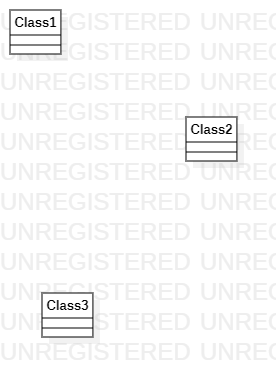

# 实验一

## 一、实验目标
1、学习和使用Git和StarUML
## 二、实验步骤
1、下载并安装Git和StarUML
2、fork项目到个人仓库
3、clone项目到本地磁盘
4、用StarUML创建UML图
5、创建并编辑实验文档
6、用Git上传UML图及文档
7、在github上继续编辑实验文档，插入UML图
8、pull request
## 三、实验结果

第一张UML图
