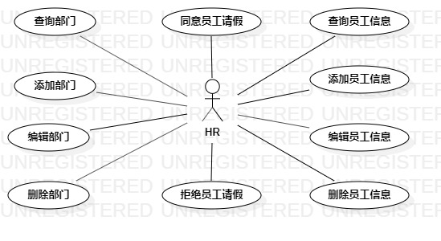

# 实验二

## 一、实验目标
1、熟悉github操作  
2、创建并完善选题  
3、熟悉StarUML  
4、了解并掌握用例图的画法  
## 二、实验内容
1、创建用例图  
2、编写实验报告文档  
3、编写用例规约 
## 三、实验步骤
1、确定选题：人事管理系统  
2、确定参与者：HR  
3、确定用例：  
(1)录入员工  
(2)编辑员工信息  
(3)删除员工  
4、用StarUML画人事管理系统的用例图，保存命名为lab2_UseCaseDiagram.jpg  
5、编写用例规约
## 四、实验结果

人事管理系统用例图  
  
## 表1：录入员工用例规约  
用例编号  | emp01 | 备注  
-|:-|-  
用例名称  | 录入员工 |   
前置条件  |     | *可选*   
后置条件  |     | *可选*   
基本流程  | 1. HR点击录入员工链接；  |*用例执行成功的步骤*    
~| 2. 系统显示员工录入页面；  |  
~| 3. HR输入员工信息，点击保存按钮；  |  
~| 4. 系统查询员工信息，检查员工身份证号码不存在；  |   
~| 5. 系统查询员工信息，检查员工编号不存在；  |   
~| 6. 系统保存员工信息，提示"录入员工成功"；  |   
~| 7. 系统显示员工列表页面。  |   
扩展流程  | 4.1 系统查询员工身份证号码存在，提示"员工已存在"。 |*用例执行失败*  
~| 5.1 系统查询员工编号存在，提示"员工编号已使用"。  |   
 
## 表2：编辑员工信息用例规约  
用例编号  | emp02 | 备注  
-|:-|-  
用例名称  | 编辑员工信息 |   
前置条件  |  HR进入员工列表页面   | *可选*   
后置条件  |     | *可选*   
基本流程  | 1. HR选中要编辑的员工信息； |*用例执行成功的步骤*   
~| 2. HR点击编辑员工按钮；  |  
~| 3. 系统显示员工信息编辑页面；  |  
~| 4. HR输入员工信息，点击保存按钮；  |  
~| 5. 系统查询员工信息，检查员工编号存在；  |   
~| 6. 系统保存员工信息，提示"编辑员工成功"；  |   
~| 7. 系统显示员工列表页面。 |  
扩展流程  | 5.1 系统查询员工编号不存在，提示"员工不存在"。 |*用例执行失败*  
  
## 表3：删除员工用例规约
用例编号  | emp03 | 备注  
-|:-|-  
用例名称  | 删除员工 |   
前置条件  |  HR进入员工列表页面   | *可选*   
后置条件  |     | *可选*   
基本流程  | 1. HR选中要删除的员工信息；  |*用例执行成功的步骤*   
~| 2. HR点击删除员工按钮；  |   
~| 3. 系统查询员工信息，检查员工编号存在；  |   
~| 4. 系统删除员工信息，提示"删除员工成功"；  |  
~| 5. 系统显示员工列表页面。 |  
扩展流程  | 3.1 系统查询员工编号不存在，提示"员工编号不存在"。 |*用例执行失败*  
  
