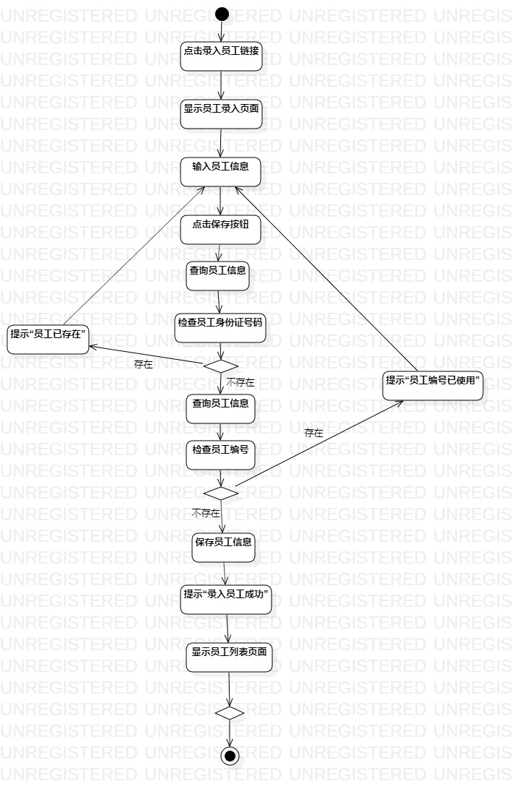
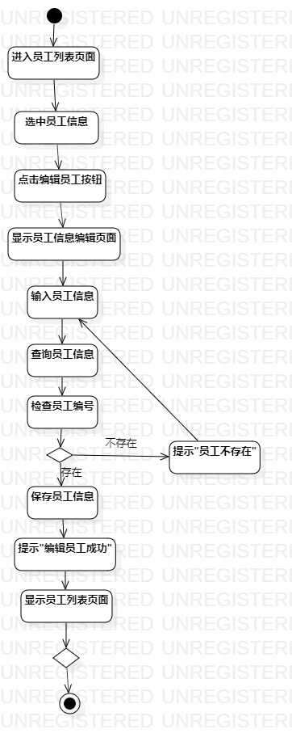
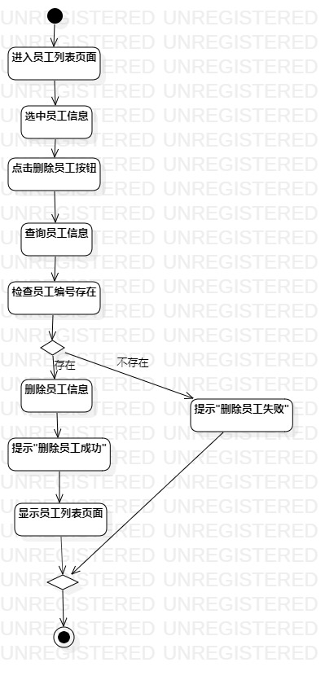

# 实验三

## 一、实验目标
1、掌握过程建模方法；  
2、掌握活动图的画法。（Activity Diagram）  
## 二、实验步骤
1、了解UML活动图的画法；  
2、根据实验二的三个用例规约（录入员工、编辑员工、删除员工）分别画出活动图；  
3、添加Initial和Final；  
4、根据用例规约的功能添加Action；  
5、在出现分支操作的时候添加Decision；  
6、用Control Flow把所有的控件连接起来。  
## 三、实验结果

图1:录入员工活动图

图2:编辑员工活动图

图3:删除员工活动图
