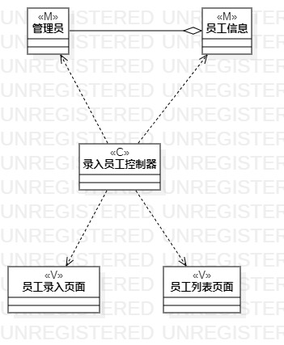
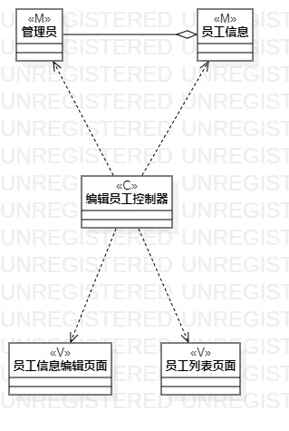
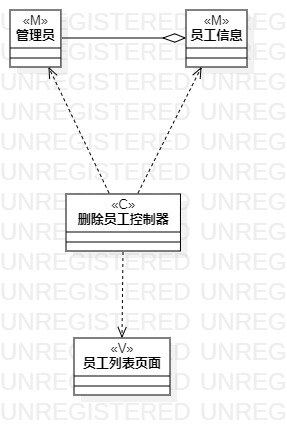

# 实验四：类建模
# 实验五：高级类建模

## 一、实验目标  
1、掌握类建模方法；  
2、掌握类图的画法；  
3、了解MVC模式。
## 二、实验内容  
根据实验二的三个用例规约（录入员工、编辑员工、删除员工）并用MVC设计模式分别画出类图。    
## 三、实验步骤  
### 实验操作
1、了解类图的画法；  
2、了解类的五种关系；   
3、根据用例规约画出类图。
### 实验笔记
1、类主要描述了两方面：属性和操作；   
2、关于类的画法“矩形=名称+属性+操作”（属性和操作可选）；   
3、类的关系有五种，分别为：Dependency、 Association、Aggregation、Composition、Inheritance；   
4、MVC设计模式：Model、View、Controller。
## 四、实验结果  

图1:录入员工类图

图2:编辑员工类图

图3:删除员工类图
