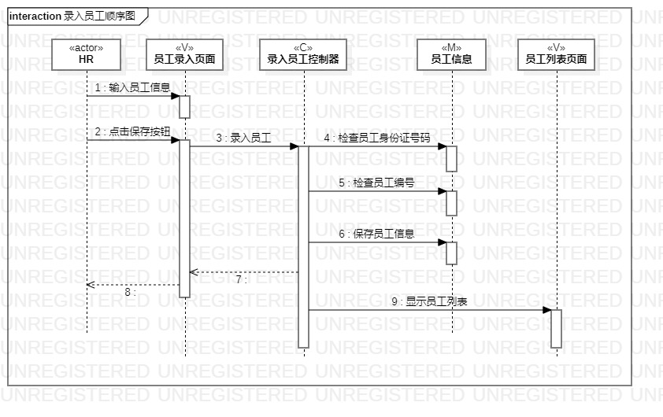
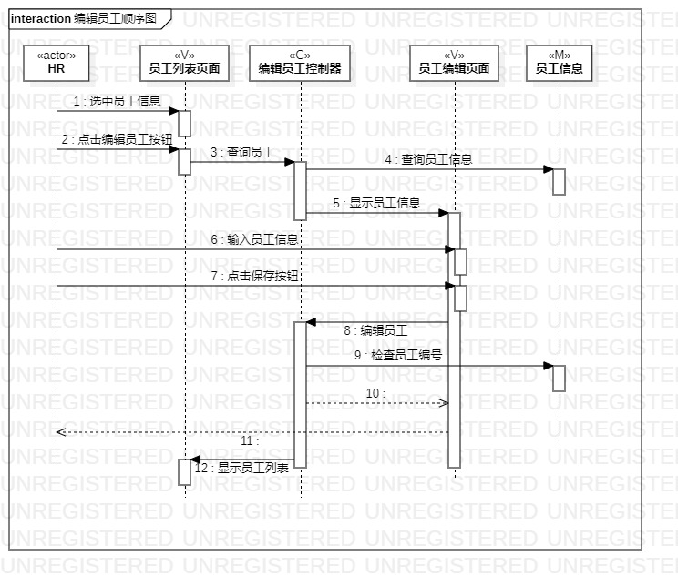
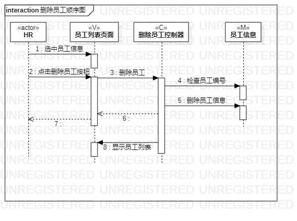

# 实验六：交互建模
## 一、实验目标  
1、理解系统交互；  
2、掌握UML顺序图的画法；  
3、掌握对象交互的定义与建模方法。  
## 二、实验内容 
1、根据用例模型和类模型，确定功能所涉及的系统对象；  
2、在顺序图上画出参与者（对象）；  
3、在顺序图上画出消息（交互）。  
## 三、实验操作  
1、了解顺序图各种符号的用法；  
2、根据用例规约（录入员工、编辑员工、删除员工）分别创建顺序图；  
3、根据之前的类图创建actor、view、controller、model；  
4、根据之前的活动图确定顺序并画出来；  
5、编写实验报告并提交。  
## 四、实验结果  

图1:录入员工顺序图

图2:编辑员工顺序图

图3:删除员工顺序图
