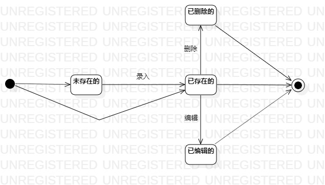

# 实验七：状态建模
## 一、实验目标  
1、掌握对象状态建模（状态图，Statechart）。
## 二、实验内容 
1、根据用例模型和类模型，确定一个关键的对象；  
2、根据对象的状态和条件画出状态图。  
## 三、实验操作  
1、了解状态图各种符号的用法；  
2、根据用例模型和类模型，寻找一个关键的对象；  
3、在状态图上设计该对象（员工信息）的关键状态；  
4、根据用例模型设计状态之间的转变条件；  
5、编写实验报告并提交。  
## 四、实验结果  

图1:员工信息的状态图
