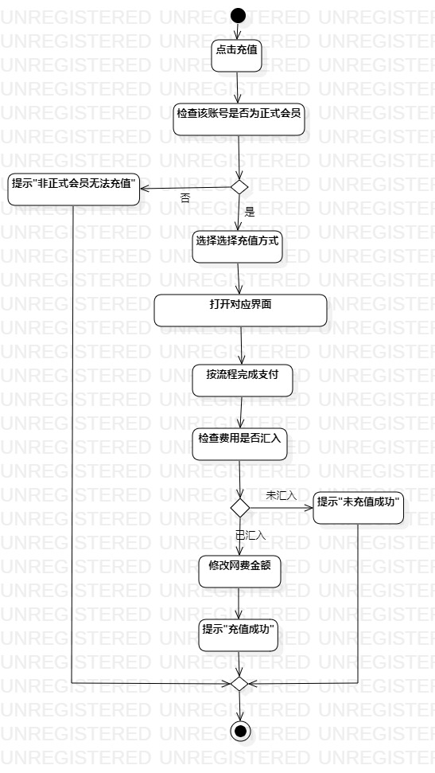
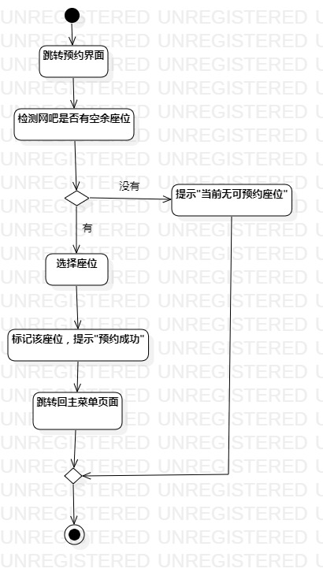

# 实验三 过程建模

## 一、实验目标

### 1.掌握过程建模概念；
### 2.掌握活动图的画法。

## 二、实验内容

### 1. 使用ActivityDiagram类画活动图；
### 2. 通过活动图描述用例的基本流程。

## 三、实验步骤

### 1. 在StarUML中创建ActivityDiagram;
### 2. 画出起点Intial;
### 3. 根据用例流程画Action,分支用Decision和Merge;
### 4. 画出终点Final。

## 四、实验结果

图1：网费充值活动图

图2：座位预约活动图

